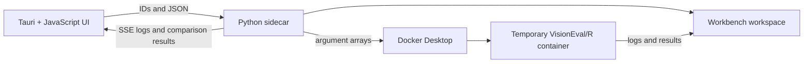

# Architecture

## Process model

VisionEval Workbench has four layers:

1. **Tauri desktop shell (Rust):** owns first launch, desktop configuration, workspace selection and movement, native dialogs, application menus, runtime profiles, and the Python sidecar lifecycle.
2. **Browser interface (plain HTML/CSS/JavaScript):** renders Explore, Create, Run, Compare, onboarding, settings, and status. It talks to the local sidecar with ID-based HTTP requests and receives run output through server-sent events.
3. **Python sidecar:** owns workspace records, scenario preparation, the global runtime queue, comparison/catalog operations, Explore metadata, dependencies, documentation installation, and the local HTTP API.
4. **VisionEval runtime (Docker/R):** runs one disposable container per model job. The workspace is the only mounted host tree. R helpers read datastores and execute batch comparisons.

The app does not keep a persistent model container. A runtime profile identifies and verifies an immutable image; containers are created for jobs and removed afterward.

## Startup sequence

1. Tauri reads the versioned desktop configuration.
2. If onboarding is incomplete, it asks the user to create or select a workspace and optionally verify a runtime profile.
3. The selected workspace is validated. Missing paths enter recovery instead of silently creating a replacement.
4. Tauri starts the packaged Python sidecar on a free loopback port and passes the workspace, runtime profile, resource preferences, and parent process ID through environment variables.
5. The sidecar initializes workspace directories and catalogs, synchronizes the bundled user guide, recovers the global queue, and exposes `/api/health`.
6. Tauri navigates the window to the sidecar URL only after health succeeds.

## Scenario-to-result flow

Projects pin one model-template ID and one InputLibrary ID. The baseline is either untouched inputs or an existing registered result. Editable scenarios remain in the manifest's internal `variations` collection for compatibility.

For a run, the sidecar clones the complete template, overlays the selected library, applies saved scenario CSV changes, writes provenance, and reserves a global runtime slot. VisionEval writes to the prepared model's `results/`. A successful result is registered only after `Datastore/DatastoreListing.Rda` is verified. Failed, stopped, or partially exported runs are not registered.

## Trust boundaries

- The UI submits internal IDs; backend code resolves filesystem paths.
- External folders are accepted only by explicit import commands.
- Workspace writes use containment checks and atomic JSON replacement where practical.
- Docker receives argument arrays rather than shell-built commands.
- Only the configured workspace is mounted into model containers.
- Packaged documentation and metadata are treated as versioned application resources, not user-editable configuration.
