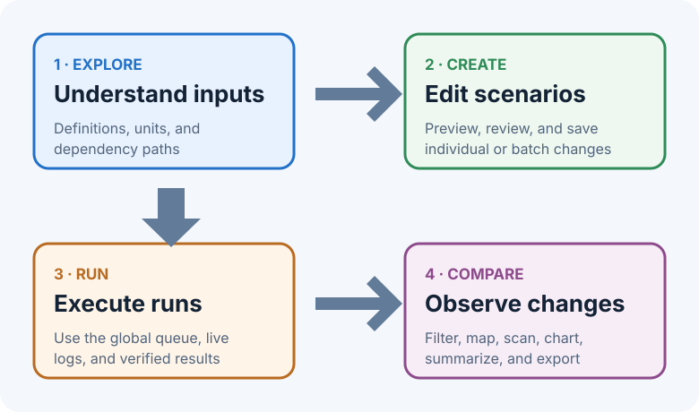
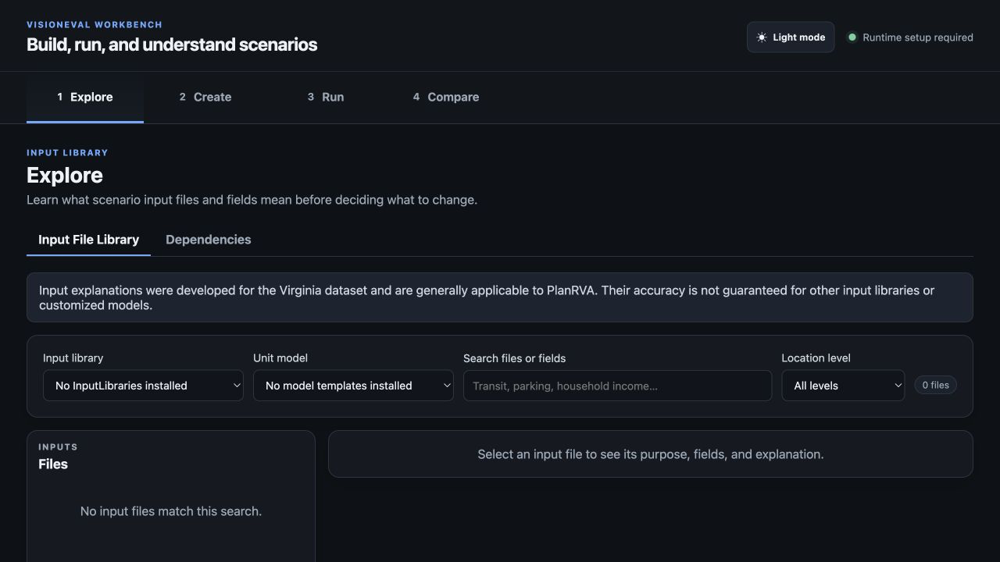
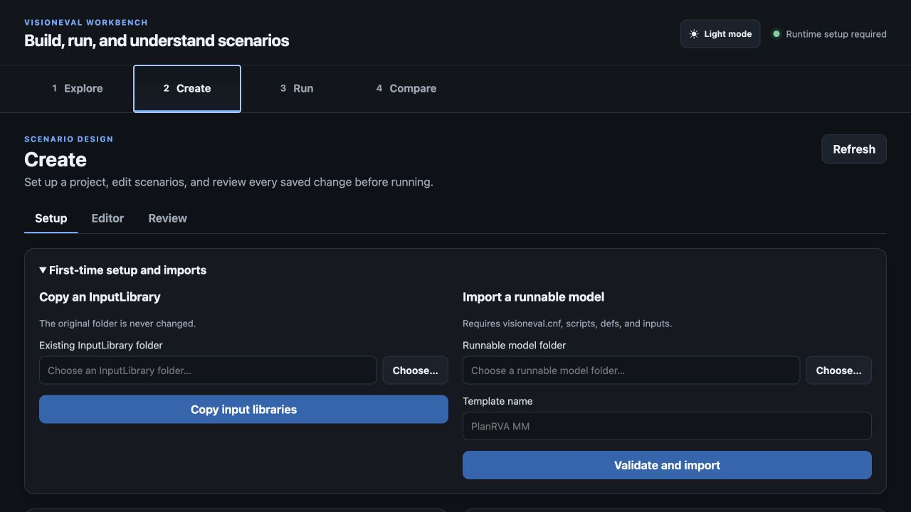
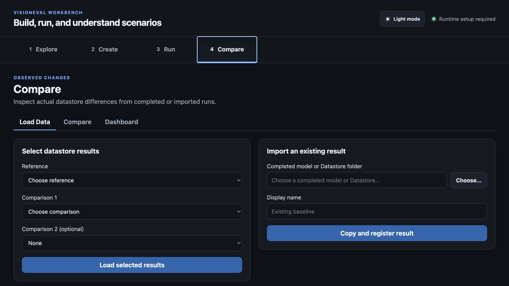

<!-- Generated by packaging/build_user_guide.py from docs/user-macos. Do not edit this file directly. -->
# VisionEval Workbench User Guide

This repository copy is generated from the same macOS guide bundled with VisionEval Workbench 1.0.0.

---

## Overview

VisionEval Workbench 1.0.0 is a local desktop application for learning a VisionEval model, designing repeatable input scenarios, running those scenarios in an isolated Docker runtime, and comparing the resulting datastores. It is intended to make the full scenario workflow inspectable without editing model folders by hand.

The normal workflow has four parts:

1. **Explore** input files and possible model dependencies.
2. **Create** a baseline and edited scenarios.
3. **Run** VisionEval through the verified Docker runtime.
4. **Compare** completed datastores to see what actually changed.



## How it works

- The native macOS shell starts a local backend and displays the Workbench interface. Project data stays in the workspace you select.
- The standard app starts without model or regional-data packages. Verified PlanRVA and Virginia packages can be installed independently from **Settings → Assets → Add package**; other imported assets are copied into the workspace and their external source folders are not edited.
- Saved scenarios record only deliberate CSV changes and notes. Each run prepares a fresh model copy, applies the selected scenario, and preserves provenance.
- VisionEval executes in a temporary Docker container created for that job. Workbench provides the pinned GHCR installation commands, verifies the installed image, and remembers its immutable digest; it does not connect to a permanent container.
- Successful datastores are registered for Compare. A disposable SQLite cache accelerates paging, filtering, statistics, scans, dashboards, and exports while the RDA datastore remains authoritative.
- Dependency diagrams show relationships declared by the selected model. Compare shows observed differences. A dependency path is not proof that a particular change caused a numerical result.

## Start here

- [Setup](docs/user-macos/setup.md) — install Docker, obtain and verify the runtime image, connect it to Workbench, and import assets.
- [Getting started](docs/user-macos/getting-started.md)
- [How Workbench works](docs/user-macos/how-workbench-works.md)
- [Core concepts and glossary](docs/user-macos/core-concepts.md)
- [Assumptions and interpretation limits](docs/user-macos/assumptions.md)
- [Explore inputs and dependencies](docs/user-macos/explore.md)
- [Create and review scenarios](docs/user-macos/create-and-review.md)
- [Run VisionEval](docs/user-macos/run.md)
- [Compare results](docs/user-macos/compare.md)
- [Build your own package](docs/user-macos/package-authoring.md)
- [Virginia MPO package](docs/user-macos/virginia-package.md)
- [Settings, workspaces, and storage](docs/user-macos/settings-workspaces-storage.md)
- [Units, rounding, and provenance](docs/user-macos/data-units-provenance.md)
- [Troubleshooting](docs/user-macos/troubleshooting.md)
- [Keyboard shortcuts](docs/user-macos/keyboard-shortcuts.md)

## What works without Docker?

Explore, Create, workspace management, and viewing already registered comparison data remain available when Docker Desktop is absent or stopped. Docker is required to run VisionEval and may be required to read uncached R data.

## Current platform

This guide covers Apple Silicon macOS with the Docker ARM64 runtime. Intel Mac is not supported. The unofficial Workbench runtime uses the official VisionEval `VE-40-RC6` source plus a Workbench household-ID prediction-ordering patch for `VETravelDemandMM::DoPredictions`. The patch matches complete household identifiers to preserve the original datastore order. It is not an official VisionEval distribution. See [Setup](docs/user-macos/setup.md) for the managed runtime install and verified local-build procedures.

The PlanRVA and Virginia packages are installed separately from the application. The DMG and ARM64 runtime are specific to Apple Silicon macOS.

## Your notes are safe

Workbench maintains this guide when the application is upgraded. Put your own documentation in the neighboring `Documentation/User Notes/` folder. Workbench never changes files there.

---

# Setup

This page is the setup path for VisionEval Workbench 1.0.0 on Apple Silicon macOS. Intel Mac is not validated.

## What you need

- An Apple Silicon Mac running macOS 12 or newer.
- VisionEval Workbench 1.0.0.
- Docker Desktop for Apple silicon if you want to run models or read uncached RDA data.
- The separately distributed PlanRVA package, or another VisionEval InputLibrary and complete runnable model folder for your own project.

Explore, Create, workspace management, and already cached comparisons work without Docker. Run requires the verified runtime described below.

## 1. Install VisionEval Workbench

Download `VisionEval-Workbench-v1.0.0-macos-arm64.dmg` from the v1.0.0 GitHub release. Open it and drag **VisionEval Workbench.app** to **Applications**.

The v1.0.0 application is ad-hoc signed for bundle integrity but is not Apple-notarized. If macOS says the downloaded application is damaged or cannot be opened, select **Cancel** and run this once in Terminal:

```bash
xattr -dr com.apple.quarantine "/Applications/VisionEval Workbench.app"
open "/Applications/VisionEval Workbench.app"
```

This removes the download quarantine attribute from this local application copy. It does not disable Gatekeeper globally.

## 2. Choose a workspace

On first launch, choose where Workbench should store imported assets, projects, jobs, results, caches, and your notes. The suggested location is:

`~/VisionEval Workbench Workspace`

Use an empty folder or a recognizable existing Workbench workspace. Workbench remembers the location. If it later moves or becomes unavailable, Workbench asks you to locate it rather than silently creating a replacement.

## 3. Install and start Docker Desktop

1. Download and install [Docker Desktop for Mac with Apple silicon](https://docs.docker.com/desktop/setup/install/mac-install/).
2. Open Workbench. If Docker is stopped, select **Start Docker Desktop** in onboarding, Run, or **Settings → Runtime**.
3. Wait for Docker to report that its engine is running.

Workbench does not run Docker permanently and does not shut down Docker Desktop when Workbench quits. It creates a disposable container only for an actual VisionEval job.

## 4. Install the VisionEval runtime

Workbench installs the pinned runtime image and verifies it for you. The exact commands remain visible under **Runtime Setup → Advanced manual setup** for auditing and troubleshooting.

1. Install Docker Desktop for Apple Silicon.
2. Open Workbench.
3. Select **Install runtime** in first-launch setup or **Settings → Runtime**.
4. Wait while Workbench starts Docker Desktop if needed, pulls the immutable image digest, creates the local alias, and runs the complete verification.
5. Confirm the screen reports that the runtime is installed, verified, and connected and that Run is available.

The first download can take several minutes. macOS may ask whether Workbench can send notifications the first time it tries to notify you that the runtime is ready. Denying notifications does not prevent the runtime from installing.

Verification automatically runs `doctor`, `verify-upstream-release`, and `verify-alignment-patch`. **Verify runtime** remains available to repeat those checks later without downloading the image again.

## Advanced: runtime image details

Workbench 1.0.0 expects this local image name:

`local/visioneval:1.0.0-arm64`

The image starts from the official VisionEval `VE-40-RC6` source at commit `f7ef3389b5626daeba6c86eeda9d172a0f8cccc2`, built for ARM64 with R 4.5.1. It also contains the narrowly scoped, unofficial Workbench patch `2026-08-03-composite-household-id-alignment`. The patch restores predictions to datastore order by matching complete household IDs; it does not use RC6's ambiguous numeric-suffix ordering. The image is not an official VisionEval distribution.

### Recommended method: pull the published GHCR image

Pull the v1 runtime package from GHCR:

```bash
docker pull ghcr.io/nikolasleeb/visioneval-workbench-runtime:1.0.0-arm64
docker tag \
  ghcr.io/nikolasleeb/visioneval-workbench-runtime:1.0.0-arm64 \
  local/visioneval:1.0.0-arm64
```

The compatibility manifest records the immutable `@sha256:…` digest. Use that digest instead of the mutable tag when reproducing or auditing a release.

### Fallback method: build the image locally

From the root of the Workbench source folder, run:

```bash
docker build \
  --platform linux/arm64 \
  --build-arg VISIONEVAL_REF=VE-40-RC6 \
  --build-arg VISIONEVAL_COMMIT=f7ef3389b5626daeba6c86eeda9d172a0f8cccc2 \
  --tag local/visioneval:1.0.0-arm64 \
  runtime
```

The first build can take a long time because Docker must download the R base image, compile/install VisionEval packages, and build several large layers. Later builds can reuse Docker's cache.

Verify the finished image:

```bash
docker run --rm --platform linux/arm64 \
  local/visioneval:1.0.0-arm64 doctor

docker run --rm --platform linux/arm64 \
  local/visioneval:1.0.0-arm64 verify-upstream-release

docker run --rm --platform linux/arm64 \
  local/visioneval:1.0.0-arm64 verify-alignment-patch
```

All three commands must succeed. The last command exercises shuffled composite county household IDs and rejects missing, duplicate, unexpected, and non-finite prediction results.

### If someone gives you an approved image archive

Load the archive, then confirm that it created the expected local tag:

```bash
docker load --input visioneval-workbench-runtime-1.0.0-arm64.tar
docker image inspect local/visioneval:1.0.0-arm64
```

Do not rename an unknown image to the expected tag merely to bypass verification. Workbench also checks its embedded release, source commit, architecture, required packages, and digest.

## 5. Install PlanRVA or another model package

The standard application starts without model assets. The optional `planrva-mm-1.0.0.zip` package contains the public **PlanRVA MM** InputLibrary, complete runnable model, and Virginia map context. It contains 52 input files: 51 CSVs plus `model_parameters.json`.

1. Open **Settings → Assets**.
2. Select **Add package** and choose `planrva-mm-1.0.0.zip`.
3. Confirm that **PlanRVA MM** appears under both InputLibraries and model templates.
4. To use an unpackaged model, expand **Advanced imports → Unpackaged assets** and import an InputLibrary and a complete runnable VisionEval folder containing at least:
   - `visioneval.cnf`
   - `scripts/run_model.R`
   - `defs/`
   - `inputs/`
5. Optionally choose defaults for new projects.

Workbench copies imported assets into its workspace and never edits the external source folders.

Install `virginia-mpo-regions-1.0.zip` separately to enable Virginia MPO region building. MPO regions are the supported execution scope. Statewide geometry may appear as map context, but a runnable statewide Virginia region is not offered in this release. See [Virginia MPO package](docs/user-macos/virginia-package.md).

## 6. Confirm the installation

Before relying on the setup:

1. Open **Explore** and confirm the Input File Library and Dependencies view load for the imported template.
2. Create a small project and save a test scenario change.
3. Open **Run**, select only the intended scenario, and start it.
4. Confirm live R output appears and the result is registered only after verification succeeds.
5. Open **Compare** and load the completed datastore.

The patched runtime was smoke-tested through the complete PlanRVA 2024 model year, including the two `VETravelDemandMM` modules that fail with the unpatched RC6 ordering implementation. A model-specific smoke test remains part of release validation because image verification cannot prove every custom model completes.

## Updating VisionEval later

Do not overwrite the trusted runtime with a floating `latest` image. For a later official VisionEval release:

1. Review the upstream release and resolve its immutable source commit.
2. Update the runtime Dockerfile, Workbench runtime constants, compatibility manifest, workflow tags, documentation, and verification test together.
3. Build a new versioned image tag.
4. Run `doctor`, release verification, automated tests, a representative model, and comparison parity checks.
5. Record and approve the new image digest before making it the Workbench default.

The detailed maintainer procedure is in [Runtime image maintenance](docs/developer/runtime-image-maintenance.md).

---

## Getting Started

## First launch

On the first launch, Workbench asks where to keep its workspace. The recommended location is:

`~/VisionEval Workbench Workspace`

That location is easy to find from your Home folder. You can instead choose an empty folder or select a recognizable existing Workbench workspace. Workbench remembers the selected workspace and reopens it on later launches.

If the saved folder is moved, disconnected, or deleted, Workbench shows recovery choices. It does not silently create a different workspace.

## Runtime setup

The runtime step is optional during onboarding. Follow [Setup](docs/user-macos/setup.md) for the supported Docker Desktop installation, local image build, verification, and Workbench connection procedure.

Workbench does not connect permanently to a container. It creates temporary containers only while running models.

Choose **Skip for Now** if you want to explore inputs, create scenarios, or inspect existing results without running a model.

## Install assets

New workspaces intentionally contain no model or input data.

- An **InputLibrary** is a folder of scenario input CSV files.
- A **model template** is a complete runnable VisionEval model folder.

Open **Settings → Assets** or **Create → Setup** to import them. A runnable model must contain:

- `visioneval.cnf`
- `scripts/run_model.R`
- `defs/`
- `inputs/`

Workbench copies imported assets into the workspace. It never edits the original folders.

## Create your first project

1. Open **Create → Setup**.
2. Choose a project name, model template, and InputLibrary.
3. Choose an untouched baseline or a compatible completed baseline.
4. Create the project. Workbench opens the Editor.
5. Select **New Scenario**, then **New File** to edit one input CSV or **Batch Change** to apply the same operation across several files.
6. Save changes, open Review, and continue to Run when validation passes.

The Run confirmation never starts automatically when you enter the Run tab.

---

## Core Concepts and Glossary

## Assets and projects

**InputLibrary**
A named collection of input CSV files. Workbench copies it during import and uses it as the original source for scenario edits.

**Model template**
A validated, complete VisionEval model. It supplies configuration, module order, definitions, and base inputs. Every project uses one pinned template.

**Project**
A comparison workspace that pins a model template and InputLibrary and contains a baseline, editable scenarios, and run/result references.

**Baseline**
The reference scenario. A fresh baseline uses untouched project inputs. An existing completed baseline can be referenced, but Workbench warns when its provenance cannot be verified against the project.

**Scenario**
A named set of saved file changes and notes. A scenario starts from the project's untouched inputs; only saved file changes are applied when it runs.

## Model execution

**Run / job**
One execution of the baseline or a scenario. Each job has a state, log, runtime provenance, prepared model folder, and result verification.

**Batch**
A group of selected jobs submitted together in queued or parallel mode.

**Runtime profile**
The verified Docker adapter, platform, architecture, image reference/digest, version, and verification date. It is not a permanent container.

## Model data

**Input**
A user-editable CSV field read by an executed module.

**Module**
A VisionEval modeling step executed by the selected template's `run_model.R`.

**Intermediary**
A datastore value produced by one module and consumed by a later module. It may remain stored in the final datastore.

**Stored output**
A value available in completed results. An output may also be an intermediary.

**Dependency path**
A declared route from an input through modules and datastore values to a reachable output. It shows a possible effect, not proof that every input change will alter every output.

**Datastore**
VisionEval's structured results, including `DatastoreListing.Rda`. Successful verified datastores are registered in Compare.

## Geography

**Azone, Bzone, Czone, Marea**
VisionEval geography levels defined by the selected model. Their meaning and relationships come from that template's `defs/geo.csv`.

**County filter**
A convenience mapping from county labels to related Azone and Bzone values. It selects matching rows; it does not aggregate them into a county total.

---

## Explore Inputs and Dependencies

Explore has two subtabs: **Input File Library** and **Dependencies**.



## Input File Library

On a fresh install, Workbench shows built-in VisionEval input metadata so you can browse common input files before installing any package. After a package is installed, choose its InputLibrary for the model-specific file list and authoritative package details. Select a CSV file to see:

- The file's purpose and geography level.
- Field names, descriptions, data types, and display units.
- The metadata source and unresolved warnings.
- Longer explanations when a guide package is available.
- A link to view the file in Dependencies.

Built-in metadata is useful for orientation, but installed packages provide the actual model/InputLibrary files, package-specific fields, and explanation guides used by projects.

Check the selected model's documentation whenever its files or modules have been customized.

## Dependencies

Choose a dependency source before exploring dependencies. Workbench derives the network from an installed or imported model template when one is available. If no template is installed, a completed run may provide enough model context for a dependency source; otherwise run a scenario or install/import a model template first.

The network opens as a compact, ordered overview of the executed modules. Drag its background to pan, scroll or pinch to zoom, and use **−**, **+**, **100%**, or **Fit** for precise control. The minimap shows which part of the model is visible. Search centers an overview node; press Return to focus any matching input, table, file, module, or package.

You can focus by input file, input field, executed module, datastore intermediary, or stored output. File and field focus answer “what reads this selection directly?” and separate the selected source, modules using it, and values those modules write. When you click a module, Workbench keeps the **Selected path** first. Use **Full module context** to add every other file column and earlier model value the module reads. Breadcrumbs preserve each step you follow.

Focused module lanes describe roles in the selected operation: **Source files**, **Values read** (separated into file columns and prior model values), **Selected module**, and **Values written**. A value stored elsewhere in the model appears under prior model values when it is being read here. Values written counts only direct outputs of the selected module. Equivalent file-input and datastore-read declarations are displayed once.

Modules chosen directly from the toolbar or search open in full module context. Modules reached from a file or field offer both scopes. **Show Full Model** returns to the ordered overview.

Intermediaries and stored outputs open in **How produced**. This view shows the selected value’s one exact producing step: the producer’s direct files, columns, and earlier values, the producing module, and only the selected value. Select an earlier value to continue tracing upstream without opening hundreds of nodes at once. **Where used** shows only later modules that directly read the selected value; the producing module is never mixed into that list. Framework values with no declared producer open in **Where used** and state that their source was not declared.

Use **SVG** to save a single infinitely scalable canvas. **PDF** creates a vector document; large full-model graphs are tiled across readable landscape pages while focused paths normally fit on one page.

In the full overview, colors and labels distinguish:

- Scenario inputs.
- Executed modules.
- Datastore values/intermediaries.
- Stored outputs.
- Unresolved custom modules.

An input file may be installed but unused by the selected model. Workbench labels it **Not used by this model's execution path** instead of creating a relationship.

## Reading the network correctly

A path means an executed module declares that it reads the input or datastore value and a downstream producer/consumer relationship exists. It does not measure sensitivity, prove causation, or guarantee a numerical result change.

In a focused module view, **Values from earlier steps** are datastore values the selected module reads. When the graph knows the producing step, the value is labeled **From _number_. _ModuleName_**. Values without a preceding declared `Set` are labeled **Loaded earlier — source not declared**; Workbench does not invent a producer for framework-initialized values. These labels describe model execution lineage and do not require the user to change scenario inputs.

After running scenarios, Compare provides observed evidence about which outputs actually changed.

For implementation details, module source, and the broader VisionEval project, see the [official VisionEval User Guide](https://visioneval.github.io/docs/) and [official VisionEval repository](https://github.com/VisionEval/VisionEval).

---

## Create and Review Scenarios

Create opens on **Setup** and also provides **Develop**, **Editor**, and **Review** subtabs. Explicit workflow actions still take you directly to the relevant subtab.

Opening **Develop** starts preparing installed regional-package map geometry in the background. The status beside **View map** indicates whether geometry is being prepared, ready, cached locally, or needs a retry. A first load uses the package's official geometry services; later loads can use the local cache.



## Develop a packaged region

Develop creates an InputLibrary and runnable model template from an installed regional data package. The core Workbench app does not include a state package. When none is installed, Develop shows an **Install regional package** action instead of state-specific controls.

1. Install a regional package ZIP supplied for the state or region you need.
2. Choose the package, its source InputLibrary, and a region definition.
3. Review the package's source links, source-check date, and source notes.
4. Review or edit the generated region name, code, and state.
5. Select **Preview region**.
6. Review the selected Azone and Bzone counts, boundary cases, copied/defaulted files, and warnings.
7. Select **Build region assets** only after the preview is acceptable.
8. Continue to Setup and create a project from the generated model template and InputLibrary.

The package's official region is the default, not a locked boundary. Select **Customize** under Geography to add or remove whole Azones or individual Bzones before previewing. A CSV may contain an `Azone` column, a `Bzone` column, or both. Azone values may be locality names or five-digit FIPS codes; Bzone values are full GEOIDs. The import replaces the dialog's current draft and is validated against the selected MPO's participating localities.

Virginia statewide geometry remains available as supporting map context where the installed package provides it. Workbench does not offer a full-state Virginia runnable build in this release because the statewide input set has known execution limits in VisionEval.

Custom geography is written to the generated manifest with the final Azone/Bzone lists and the Bzones added or removed relative to the official package selection. **Restore official** resets the draft at any time before previewing.

Each package is independent. Installing a package for another state adds that package's terminology, regions, inputs, crosswalk, and provenance without changing or requiring the Virginia package.

### Virginia MPO package

The separately built **Virginia MPO Regional Data** package contains the statewide Virginia InputLibrary, all 15 MPO definitions, and a versioned spatial crosswalk between official VDOT MPO Study Areas and Virginia VisionEval Bzones. The collapsed **Data sources** section records the official source links and the date those sources were checked without interrupting the region workflow.

A Bzone is included when its representative point is inside the MPO or at least half of its area overlaps. Bzones below 99% overlap are reported as boundary cases in the preview and build manifest. If the crosswalk does not match the package InputLibrary, Workbench reports the mismatch instead of mixing source versions.

The generated boundary is accurate to complete Bzones, not an exact clipping of the MPO polygon. Workbench does not split a Bzone that crosses the official boundary. Azone and Marea input rows also remain whole-locality values, and region/non-spatial files are copied unchanged. Treat those inputs and any generated defaults as modeling assumptions requiring review before policy use.

Use **View map** to inspect all Virginia MPO outlines, Azones, and Bzones. The map's MPO menu is exploratory: choosing an MPO highlights its official study area, selected Bzones, and included or excluded boundary cases without changing the Region Builder selection. Select any visible MPO, Azone, or Bzone to inspect its identifiers, locality, MPO memberships, current-MPO status, and recorded boundary overlap. **Zone ID labels** adds collision-reduced Azone IDs at MPO scale and Bzone IDs at close scale. Drag to pan, use the wheel or `+`/`-` controls to zoom, select **Fit MPO** to restore the review extent, or select **Virginia** to return to the statewide extent. Azones represent whole Virginia localities and can extend well beyond an MPO study area.

The first statewide map view retrieves simplified geometry from the official ArcGIS services and caches it in the local workspace. Later views use that versioned cache. Previewing and building a region use the packaged crosswalk and remain available offline even when map geometry has not been downloaded.

## Setup

Setup imports assets, creates projects, and manages saved and archived projects. The baseline is part of the project and remains read-only in the Editor.

Removing a project archives it for 30 days. Archived projects, jobs, and results disappear from normal Create, Run, and Compare lists. Restore reactivates it; Delete Now permanently removes eligible data. A project with active or waiting jobs cannot be archived.

## Editor workflow

The sidebar represents the project:

1. **New Scenario** creates an editable scenario container.
2. **New File** opens one input CSV inside that scenario.
3. Repeat New File for other individual inputs.
4. Use **Batch Change** when the same operation should affect several input files.

Duplicating a scenario copies its saved file changes and scenario note.

### Single-file mode

Choose locations, target year, editable columns, an operation, and a value.

- **Apply Preview** changes only the temporary working copy shown in the table.
- **Save File Changes** persists that preview and the file note to the scenario so Review and Run can use it.
- **Revert Preview** returns to the last saved version.
- Undo and Redo affect the current preview.
- Removing a saved file from the sidebar restores the scenario to the original InputLibrary file.

Direct table edits also remain temporary until saved. Workbench prompts before you leave a file, scenario, project, or subtab with unsaved work. **⌘S** saves the current file changes when a dirty file is open.

The table keeps saved scenario differences visible after reopening a file, including files created through Batch Change. Light yellow cells are saved changes from the original InputLibrary baseline. Darker yellow cells with an inset outline are additional unsaved preview changes. Saving converts the darker preview state to the saved-change state; Review remains the complete before/after audit.

### Batch mode

Select one or more files and fields, then use the same geography, year, operation, and value controls. **Apply and Save Batch Changes** persists the changes immediately. Files that cannot represent the selected geography are listed and skipped before you confirm.

Use the scenario note for assumptions that apply to the whole scenario. File notes remain available for file-specific context.

## Geography selection

Location options come from the project's model-template definitions. County selection begins empty; select specific counties or explicitly select all. For PlanRVA, county choices map to county-named Azones and related Bzones.

**All locations** is an explicit unfiltered mode. County mode requires at least one county.

## Review

Review compares each saved scenario file with its original InputLibrary source. It shows changed files, rows and cells, geography, years, before/after values, notes, and validation warnings.

Continue to Run is disabled when required files, schemas, geography, or model configuration are invalid. It opens Run with the reviewed project/scenarios preselected but does not start Docker.

Batch Change selections are temporary to the scenario currently open in Scenario Tools. Switching to a different scenario—or creating or duplicating one—starts with no batch files or columns selected. Saved file edits remain on their original scenario; only the unsaved batch selection is reset.

---

## Run VisionEval

The Run tab prepares and executes selected baselines and scenarios with the saved runtime profile.


## Before running

Run requires:

- Docker Desktop installed and running.
- A compatible image present at the saved immutable digest.
- Successful runtime doctor, pinned VE-40-RC6 provenance verification, and household-ID prediction-ordering verification.
- A valid project and saved scenario changes.

## Queued and parallel modes

Before a batch starts, choose:

- **Queued:** runs one selected job at a time.
- **Parallel:** allows up to two selected jobs to use the global runtime slots.

All projects share the same queue. Workbench permits at most two VisionEval runtimes across the entire application, not two per project. New work waits behind already queued work.

Waiting jobs show **Queued #1**, **Queued #2**, and so on. Use the up/down arrow controls to change their order. Active jobs cannot move. Remove from Queue deletes only the selected job that has not started.

## History and live output

Run History groups active jobs first, waiting jobs in queue order, and finished history afterward. Jobs belonging to an active batch have a green outline; a running job has stronger emphasis.

In parallel mode, each job has its own console tab. Output is not mixed. The console follows new output while you are near its bottom; scroll upward to pause follow-tail. Complete output remains in the job's `run.log`.

Removing the waiting job whose tab is selected keeps the batch console open and automatically returns Live Output to an active job from that batch when one exists. It never removes, stops, or changes the running job.

The duration badge shows elapsed time for active work and total duration for completed work.

## Stopping

Stop Selected Run is enabled only for the selected active job. When stopped, Workbench:

1. Stops and removes the Docker container.
2. Ends the local runtime process.
3. Deletes the prepared model and partial results.
4. Deletes the job manifest and log.
5. Removes the batch reference and any datastore registration.

The job disappears after cleanup. If cleanup cannot finish, a small **cleanup failed** entry remains with **Retry Cleanup**. The runtime slot stays reserved until cleanup completes.

## Quitting while a run is active

Workbench manages only its own labelled VisionEval job containers. It starts Docker Desktop only when you select **Start Docker Desktop**, never quits Docker Desktop, and never stops unrelated containers. If you close Workbench while a run is active, choose either **Stop Runs and Quit** or keep Workbench open. Quitting completes only after the selected Workbench jobs and partial files are safely cleaned up. Waiting jobs own no containers and remain queued for the next launch.

After an unexpected restart, Workbench reconnects to a still-running container only when its Workbench and job ownership labels match the saved manifest. Unverifiable containers are never stopped or removed automatically.

## Successful results

After VisionEval exits successfully, Workbench verifies `results/Datastore/DatastoreListing.Rda`. Only then is the result registered in Compare. Registration does not automatically switch tabs or select the result.

---

## Compare Results

Compare shows observed differences between completed or previously registered datastores. It has **Load Data**, **Compare**, **Map Visualization**, and **Percent-Change Chart** subtabs.



## Load Data

Choose one reference datastore and optionally up to two comparison datastores. Loading only the reference opens a single-datastore view with variable explanations, geography filters, sorting, paging, statistics, and reference exports. Deltas, change scans, percent-change summaries, and charts become available when a comparison datastore is also selected. Each result shows project, scenario, template, runtime, completion time, and verification status.

New results are registered when Workbench runs complete. Results imported by an older Workbench version remain selectable as read-only legacy records, but Compare no longer imports or manages external result folders.

Archived project results are hidden from normal selection.

## Compare values

Choose a table, variable, common year, row count, and optional geography filter. Workbench safely aligns rows by stable identifiers rather than assuming that row positions match.

Workbench builds a disposable SQLite cache from the authoritative RDA datastore. The requested page appears first while full-table statistics finish in the background. Repeating the same selection is normally much faster. Storage settings show the cache size and let you clear it; clearing the cache does not remove results.

Available analysis includes:

- Changed-row counts.
- Total percent change for numeric outputs.
- Rows-changed percentage for categorical outputs.
- Increased/decreased counts, net change, average-row percent, and distributions.
- Optional red/green directional deltas.
- Changed-rows-only filtering and pagination.
- Three-state column sorting: original, ascending, descending, then original.

Numeric values display at up to five decimal places. Geographic and entity identifiers are never rounded.

## Geography filters

Detailed comparisons, changed-output discovery, percent-change charts, and selected-location exports each have an independent location selector. A location change marks the affected result stale until its action is run again.

County filtering uses the result's model-template `defs/geo.csv` to map county labels to Azones and Bzones. Household, Vehicle, and Worker rows are included when their stored location belongs to a selected county in the reference or a comparison. County filtering is disabled for purely regional outputs that cannot be mapped safely.

## Discover changed outputs

- **Find changed outputs** scans every comparable output across the selected results; it is independent of the Table and Variable used by the detailed comparison.
- Each numeric result reports the total percent change in the variable's summed value relative to the reference. With two comparison datastores, each scenario receives its own total-percent-change value.
- **All locations** scans every location. **Selected locations** opens an independent cross-output location selector.

The activity strip shows phase, elapsed time, completion/failure, and Stop when cancellation is supported. A cold scan loads each datastore once and caches its safely keyed statistics. Repeating the same roles, data, year, and geography can use the cache.

Unsafe unknown multi-row tables and variables whose value count does not match the table's stable keys are skipped with a reason instead of reporting misleading row-position changes. One skipped variable does not stop discovery from scanning the remaining outputs.

## Chart and exports

**Map Visualization** shades package-defined geographies. The Virginia package offers **County / locality** (the package's Azone county-equivalent geometry) and **Bzone**. Technical metadata and exports retain the Azone identifier so the model geography remains explicit. Future state packages can expose County only when they provide an authoritative mapping.

Direct Azone and Bzone fields are preferred. Household and Worker outputs use their stored geography. Vehicle Bzones are derived independently in each result through `Vehicle.HhId -> Household.HhId -> Household.Bzone`; vehicles without a unique household match are counted as excluded rows. Every mapped numeric row contributes equally to the geographic mean, matching Workbench's ordinary Mean summaries rather than restricting calculations to entity IDs matched across scenarios.

The default display is Change %. Zero-to-zero is 0%; a nonzero comparison with a zero reference has no defined percent and uses the unavailable hatch. Change metrics use a symmetric diverging scale centered on zero and saturate at the 95th percentile of absolute displayed values so outliers do not flatten the rest of the map. **Map value labels** shows the active metric at useful zoom levels; it can be combined with zone IDs. Metric, MPO focus, layers, labels, zoom, and pan redraw the generated snapshot without recalculation. The map supports PDF, PNG, SVG, CSV, and Excel exports; visual exports preserve the current viewport and data exports preserve the current statewide or selected-MPO scope.

**Percent-Change Chart** displays a diverging horizontal bar chart for several numeric variables with a common year and its own optional location filter. Bars left of zero are decreases from the reference and bars right of zero are increases. After **Generate chart** finishes, Sort and Display controls immediately transform the cached result without rerunning the calculation.

**Export data** offers four products. **All Locations Changed Outputs** and **Selected Locations Changed Outputs** contain one row per changed output with a Change % column for each comparison. **Current View** contains every matching row for the active variable, comparison location scope, and sort order, not only the displayed page. **Full Variable Data** exports every row for one or more comparison-compatible outputs in original order and ignores active location filters. Its CSV option creates a ZIP with one CSV per output; its Excel option creates a workbook with separate variable sheets and an index. The macOS **Export** menu exposes the same products.

Excel workbooks add frozen and filtered headers, typed values, readable widths, neutral delta highlighting, statistics, and a provenance sheet. Provenance records datastore IDs and fingerprints, year, table, variable, units, geography filters, five-decimal comparison precision, generation time, and Workbench version without exposing workspace paths. Large datasets are split across numbered sheets rather than truncated. Workbook generation is reconnectable and cancellable from the Compare activity strip.

---

# Settings, Workspaces, and Storage

Open **VisionEval Workbench → Settings…** or press **⌘,**.

## Notifications

Notifications are off until you enable them. macOS still controls whether alerts are allowed; the first attempted notification can trigger the system permission prompt. In **Settings → Notifications**, enable or disable alerts for completed or failed VisionEval runs, first runtime setup, and long-running Compare work, including comparisons, change scans, datastore imports, and map/chart exports. Use **Send Test Notification** to verify notification delivery later.

Workbench suppresses alerts for old history when it launches or refreshes. It alerts only when work changes from an active state to completed or failed while the app is running.

## Workspace

Settings shows the current path and keeps optional other workspaces in a collapsed disclosure. Multiple workspaces are useful when separate organizations, production work, or testing must not share projects and assets; most users need only one. Category actions reveal Projects, Assets, Results, or Documentation without exposing technical state. The complete root remains available under **Storage → Advanced workspace access**. Switching and moving are blocked while a job is active or waiting.

**Forget** removes only the shortcut from Workbench. **Move to Trash** is available only for an inactive workspace whose identity can be verified; it moves the complete folder to the operating-system Trash. Workbench never offers either action for the current workspace.

A move is verified before Workbench saves the new path. Recovery metadata retains the previous location until the move is confirmed.

Back up the entire workspace when you need a complete portable copy. Do not copy only project manifests if you also need run results and imported assets.

The managed layout keeps user-facing data in `Projects`, `Assets`, `Results`, and `Documentation`. Settings, catalogs, run queues, caches, recovery archives, and preserved legacy files live in the hidden `.workbench` folder. Use Workbench rather than Finder to remove managed data.

## Assets

Install verified Workbench packages from the primary action at the top of Assets. Choose compact defaults for new projects, inspect installed assets in count-bearing disclosures, and open **Unpackaged assets** only for development, migration, or legacy folders that are not distributed as verified packages. Changing a default does not modify existing projects; they remain pinned to their original asset IDs and fingerprints.

Every installed asset has a removal status. Workbench blocks removal when an active or archived project still references the asset and names the affected projects. Unreferenced assets move to **Removed assets** for 30 days, where they can be restored or deleted permanently. Removing an unreferenced default clears that default after confirmation. Region Builder template and InputLibrary pairs are removed together.

## Numbers

The master decimal precision defaults to two places. Optional overrides control single-file calculations, batch calculations, displayed output values, and displayed percentages. Arithmetic results omit unnecessary trailing zeros, so increasing `2` by `10%` produces `2.2` at the default precision. Display precision never changes saved raw values or full-precision data exports.

## Appearance

Choose System, Light, or Dark. System follows macOS appearance.

## Runtime and resources

Runtime shows Docker status, saved image reference/digest, verification, and repair actions. Long image references and digests wrap within the panel; **Copy Digest** copies the complete immutable value. Automatic memory mode applies no additional Workbench cap; Docker Desktop's own allocation controls available memory. An advanced per-container limit affects new jobs only.

The panel verifies the release tag, source commit, unofficial compatibility-patch identity, and immutable image digest. Workbench 1.0.0 can install the compatible GHCR runtime image for you and then verifies that exact image before Run is enabled.

When Docker Desktop is stopped, Workbench can launch the installed application, wait for its engine, and verify the pinned runtime when available. It does not quit Docker Desktop or stop unrelated containers.

The maximum number of concurrent VisionEval jobs is fixed at two. Choose whether new batches default to queued or parallel mode.

## Storage

Full VisionEval CSV exports are retained after successful runs by default. Large model runs can use substantial disk space because Workbench may retain both the authoritative datastore and optional full CSV output. Actual size depends on the model, geography, years, and output tables.

Storage settings report datastore, full-export, prepared-model, asset, project, and workspace totals separately. Changing the retain-exports preference does not retroactively delete existing data.

The comparison cache is disposable derived data. **Clear Cache** or **Rebuild Cache** does not remove registered results. Previously imported results remain readable legacy registrations; Workbench no longer offers result import or removal controls.

## Archived projects

Archived projects remain recoverable for 30 days. Workbench purges expired archives periodically, but retains a datastore still referenced as an active project's baseline until that dependency is removed.

---

## Units, Rounding, and Provenance

## Input metadata

Workbench chooses an input display unit in this order:

1. A year or scale written in the exact CSV column header.
2. The selected model template's `defs/units.csv`.
3. The executing VisionEval module specification.
4. The human-written explanation guide.

The selected label does not erase disagreements. Explore displays a warning when sources conflict or remain ambiguous.

## Outputs and intermediaries

The producing module specification is the effective source because output columns do not have an input-file header. Disagreements with consuming modules remain visible.

Known items requiring review include D1B, OwnCostPerMile, some rate denominators, and road-cost currency fields. Workbench does not guess missing denominators.

## Rounding

Workbench rounds displayed numeric measurements to five decimal places. It does not change the underlying datastore or exported value.

Geo, Azone, Bzone, Czone, Marea, household, vehicle, and worker identifiers are treated as unitless strings. They are not rounded even when they contain only digits.

## Provenance

Projects record template and InputLibrary identities and fingerprints. Runs additionally record the project/scenario, app/runtime versions, image digest, timestamps, exit status, and result verification. Compare shows this provenance beside selectable results.

An external baseline without matching provenance is labeled compatibility unverified. That warning does not necessarily mean the data is wrong; it means Workbench cannot prove that its assets/runtime match the project.

---

## Troubleshooting

If you cannot resolve a problem, open a GitHub Issue at https://github.com/nikolasleeb/VisionEval-Workbench/issues. For run failures, include the diagnostics ZIP from **Settings → Diagnostics** or the failed run card. For app errors, include the visible message, your Workbench version, macOS version, Docker status, and the packages installed in the workspace.

## The app cannot find my workspace

Choose Retry if a removable or network volume is temporarily unavailable. Choose Locate Workspace if the folder moved. Create New starts an empty workspace; it does not recover the old one.

## Docker is not installed or stopped

Install Docker Desktop, select **Start Docker Desktop** in Workbench, and wait for the engine to report Running. Open **Settings → Runtime** and verify again. Explore, Create, and existing comparison data can still be used without Docker.

## Runtime verification fails

Check that `local/visioneval:1.0.0-arm64` exists and has not changed digest. If necessary, pull the versioned GHCR image described in [Setup](docs/user-macos/setup.md), recreate the local alias, and select **Verify runtime**. Review the `doctor`, `verify-upstream-release`, or `verify-alignment-patch` error before rebuilding the runtime.

## A PlanRVA run stops in `DoPredictions`

This error indicates that Workbench used an unpatched VE-40-RC6 image or a stale saved runtime profile. Install `local/visioneval:1.0.0-arm64`, open **Settings → Runtime**, and select **Verify runtime**. The accepted image must pass `verify-alignment-patch`; merely retagging an unpatched image will fail provenance verification.

## A project does not appear in Run or Compare

The project may be archived. Restore it from **Create → Setup → Archived Projects**. Only verified successful runs appear in Compare. Failed, stopped, or partial results are excluded.

## A scenario change is missing from a run

Apply Preview is temporary. Return to the file and select **Save File Changes** (or press **⌘S**) before Review and Run. Batch changes save immediately after confirmation.

## County filtering is unavailable

The selected output may have only regional/Marea geography, or its registered template may not contain a usable county-to-zone mapping. Choose a compatible table or use its native geography level.

## Changed-output discovery is slow

A cold scan may need to load large datastores. Keep the activity strip open to see its phase and elapsed time. Repeating the same data, roles, year, and geography can use the cache. A memory failure should report Docker resource guidance; do not repeatedly restart the same scan without checking available memory.

## Stop leaves “cleanup failed”

Workbench retains only enough information to finish cleanup. Start Docker if necessary and select **Retry Cleanup**. The result is not registered while cleanup is incomplete.

## Documentation warning

Restart the application to retry installation of the bundled guide. Files in `Documentation/User Notes/` are unaffected. If the warning remains after reinstalling the app, preserve the workspace and report the exact warning message.

## Virginia statewide run fails in `PredictHousing`

The Virginia regional package can build and map all 133 county-equivalent Azones and 5,963 Bzones. A complete statewide VisionEval execution is not release-supported, however. The current statewide inputs can reach `VELandUse::PredictHousing` with a housing allocation group that has too few positive probabilities for the requested integer sample.

This is separate from the repaired transit-input completeness issue. Reinstalling Docker or retrying the same statewide project will not correct it. Use an MPO region for executable scenario work. Keep the statewide build for geography inspection and future data validation until a scientifically defensible statewide housing-allocation rule is implemented and validated.

---

## Keyboard Shortcuts

| Shortcut | Action |
| --- | --- |
| ⌘N | New Scenario |
| ⇧⌘N | New File |
| ⌥⌘B | Batch Change |
| ⌘S | Save File Changes |
| ⇧⌘R | Review / Run Selected; always opens confirmation |
| ⌘. | Stop Selected Run |
| ⌘1 | Explore |
| ⌘2 | Create |
| ⌘3 | Run |
| ⌘4 | Compare |
| ⌘R | Refresh |
| ⌘, | Settings |

Commands that do not apply to the current project, scenario, file, or job are disabled. ⌘S saves only the currently open file preview and its file note; it does not save a batch or start a run.
