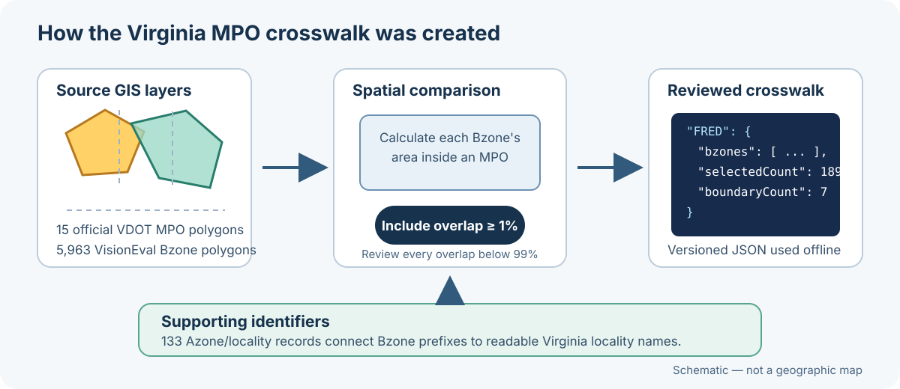

# Building a Regional Package

This guide explains how to create a regional data package like `virginia-mpo-regions.zip`. It is intended for data maintainers and developers, but the overall process does not require knowledge of the Workbench desktop code.

Regional data packages are platform-neutral. A correctly built ZIP can be installed in both the Windows and macOS editions of VisionEval Workbench 1.0.0.

> [!IMPORTANT]
> This page covers `region-builder` packages, which provide the data needed to create regional VisionEval models. PlanRVA is a different `model-bundle` package type and is not a template for this process.

## What a regional package provides

A regional package combines:

- A complete VisionEval InputLibrary for the package's full coverage area.
- Stable definitions for the regions a user may select.
- A crosswalk from each official region to its VisionEval Bzones.
- A generic, runnable VisionEval model-template scaffold.
- Optional locality names and online map references.
- A source record describing where the data came from, when it was retrieved, what may be redistributed, and any modeling assumptions.
- A manifest and internal file inventory that Workbench validates during installation.

Workbench uses the package in **Create → Develop**. It selects the requested Bzones, filters Azone-, Bzone-, and Marea-level inputs, creates `defs/geo.csv`, and produces a matching InputLibrary and model template.

## Skills and software needed

You need:

- Git and a clone of the [VisionEval Workbench repository](https://github.com/nikolasleeb/VisionEval-Workbench).
- Python 3.11.
- Familiarity with VisionEval InputLibrary CSV files and the geographic identifiers used by the model.
- A text editor and the ability to review JSON and CSV files.
- A GIS analyst or equivalent spatial-review process when official boundaries must be converted to Bzone membership.
- Shapely when running the Virginia spatial-crosswalk generator. Shapely is not required merely to assemble an already reviewed crosswalk into a ZIP.
- VisionEval Workbench on Windows and Apple Silicon macOS for final cross-platform testing.

You do not need Node.js, Rust, Tauri, Docker, or R just to assemble the ZIP. A VisionEval runtime is needed for the final model-run smoke test.

## Prepare the source material

Before writing a builder, collect and review the following inputs.

### Complete InputLibrary

Use the complete InputLibrary for the package's claimed coverage area. At minimum, Workbench 1.0.0 expects `bzone_lat_lon.csv`, and the package manifest should name other files that must always be present. The Virginia package also requires `azone_hh_pop_by_age.csv`.

Every Bzone used by a region crosswalk must appear in `bzone_lat_lon.csv`. Do not label a partial example library as statewide or otherwise broader than its actual coverage.

### Region registry

Create a version-controlled JSON registry containing each selectable region's stable ID, display name, default region code, and locality-to-Azone mapping. The Virginia example is [`virginia_mpo_regions.json`](https://github.com/nikolasleeb/VisionEval-Workbench/blob/main/macos/docs/developer/reference-data/virginia_mpo_regions.json).

Package IDs and region IDs should remain stable across package updates. Use lowercase letters, numbers, periods, hyphens, or underscores for the package ID.

### Boundary-to-Bzone crosswalk

Create a JSON crosswalk that lists the Bzones assigned to every official region. Record:

- The official boundary and Bzone sources.
- The generation date and assignment rule.
- The selected Bzones for each region.
- Boundary cases that require review.
- Feature counts or other checks that reveal incomplete source downloads.

The Virginia generator includes a Bzone in every MPO covering at least 1% of its projected area and reports overlaps below 99% as boundary cases. Those thresholds are a documented Virginia-package method, not a universal policy. Choose and defend an appropriate method for the geography being packaged.

### Virginia source-file examples

The local working folder used while developing the Virginia package contained these source examples:

- **`VDOT_MPO_STUDY_AREA_BOUNDARY_….geojson` — 15 polygon features.** Supplied the official MPO identifiers, names, and study-area boundaries.
- **`Azones.geojson` — 133 polygon features.** Connected five-digit Virginia locality identifiers to VisionEval Azones.
- **`Bzones.geojson` — 5,963 polygon features.** Supplied the `GEOID` polygons compared with each MPO boundary.
- **`AzonesBzonesVa_geojson.zip` — Azone and Bzone GeoJSON.** Preserved the downloaded working copies together.
- **`MPO_Listing_2023-09-01_acc110623_PM.pdf` — four-page VDOT listing.** Provided a human-readable check of MPO names and member localities.
- **`Notes and Links.docx` — source links.** Recorded where the ArcGIS and Virginia Roads GIS files had been obtained.

The full GeoJSON working files are not part of the released ZIP or this repository. They are large, and their publishers' terms do not authorize Workbench to redistribute the raw polygons. The builder instead stores source URLs and a small, reproducible Bzone membership crosswalk.



The diagram is intentionally schematic rather than a reproduction of the restricted source geometry. The source features looked like these shortened examples, with coordinates omitted:

```json
{
  "type": "Feature",
  "properties": {
    "OBJECTID": 1,
    "MPO_ID": "DAN",
    "MPO_NAME": "Danville Metropolitan Planning Organization",
    "Code": "4"
  },
  "geometry": {"type": "Polygon", "coordinates": ["omitted"]}
}
```

```json
{
  "type": "Feature",
  "properties": {
    "OBJECTID": 1,
    "Azones": "51001"
  },
  "geometry": {"type": "Polygon", "coordinates": ["omitted"]}
}
```

```json
{
  "type": "Feature",
  "properties": {
    "OBJECTID": 1,
    "GEOID": "510310206001"
  },
  "geometry": {"type": "Polygon", "coordinates": ["omitted"]}
}
```

The generated crosswalk is much smaller than the geometry. For example, its reviewed Fredericksburg record identifies the official MPO, lists 189 selected Bzones, and flags seven boundary cases. A shortened record looks like this:

```json
{
  "officialMpoId": "FRED",
  "officialName": "Fredericksburg Area Metropolitan Planning Organization",
  "bzones": ["511371101042", "511539011012", "…"],
  "boundaryBzones": [
    {"geoid": "511371101042", "overlapRatio": 0.016842}
  ],
  "selectedCount": 189,
  "boundaryCount": 7
}
```

These examples show the data roles and identifiers without copying the source polygons. When maintaining the package, obtain current data from the authoritative links recorded in `SOURCES.md` rather than treating an old local download as the authoritative source.

### Model-template scaffold

Provide a model-neutral template containing at least:

```text
model-template/
├── visioneval.cnf
├── scripts/
│   └── run_model.R
└── defs/
    ├── deflators.csv
    └── units.csv
```

Do not package results, caches, temporary files, or a region-specific `inputs/` directory. Workbench creates the regional inputs from the packaged InputLibrary.

### Sources and redistribution review

Create a plain-language `SOURCES.md`. For every important source, record its title, publisher, URL, publication date when known, retrieval date, attribution requirements, and redistribution restrictions. Explain derived-data methods and modeling assumptions separately from official source statements.

If a source does not authorize redistribution, package a reproducible derived crosswalk or an online reference instead of copying restricted geometry. The Virginia package follows this approach for its map sources.

## Expected ZIP layout

The ZIP must contain one wrapper directory and exactly one `workbench-package.json`:

```text
example-regions-1.0.0/
├── workbench-package.json
├── SOURCES.md
└── data/
    ├── input-library/
    │   ├── bzone_lat_lon.csv
    │   └── ...
    ├── model-template/
    │   ├── visioneval.cnf
    │   ├── scripts/run_model.R
    │   └── defs/
    ├── regions.json
    ├── region_bzone_crosswalk.json
    ├── zone_reference.json
    └── localities.txt
```

Optional resources may be omitted when their related feature is not provided, but the InputLibrary, regions, crosswalk, sources document, and model template are required for a usable region-building package.

## Manifest format

The builder writes `workbench-package.json` after copying and inventorying the payload. This shortened example shows the main contract:

```json
{
  "schemaVersion": 1,
  "type": "region-builder",
  "id": "example-regions",
  "name": "Example Regional Data",
  "version": "1.0.0",
  "coverage": "Example State",
  "state": "EX",
  "retrievedAt": "2026-08-15",
  "description": "Official regional boundaries joined to VisionEval Bzones.",
  "inputLibrary": {
    "name": "Example InputLibrary",
    "path": "data/input-library",
    "requiredFiles": [
      "bzone_lat_lon.csv",
      "azone_hh_pop_by_age.csv"
    ]
  },
  "builder": {
    "kind": "mpo-bzone-crosswalk",
    "modelTemplatePath": "data/model-template",
    "regionsPath": "data/regions.json",
    "crosswalkPath": "data/region_bzone_crosswalk.json",
    "zoneReferencePath": "data/zone_reference.json",
    "localitiesPath": "data/localities.txt",
    "localityPrefixLength": 5,
    "defaultFiles": []
  },
  "sourcesDocument": "SOURCES.md",
  "sources": [
    {
      "label": "Official regional boundaries",
      "publisher": "Example agency",
      "url": "https://example.gov/data",
      "retrievedAt": "2026-08-15"
    }
  ],
  "files": [
    {
      "path": "SOURCES.md",
      "size": 1234,
      "sha256": "internal-file-hash-written-by-the-builder"
    }
  ]
}
```

The `files` list must include every payload file once, with its byte size and SHA-256 value. Workbench uses this internal inventory to detect missing or changed package contents. The builder should generate it automatically; users do not need separate `.sha256` downloads or checksum instructions.

## Build the Virginia example

The maintained Virginia scripts are identical in the `macos/` and `windows/` source trees:

- [`build_va_mpo_crosswalk.py`](https://github.com/nikolasleeb/VisionEval-Workbench/blob/main/macos/packaging/build_va_mpo_crosswalk.py) retrieves the official boundary and Bzone layers and creates the reviewed crosswalk.
- [`build_va_region_package.py`](https://github.com/nikolasleeb/VisionEval-Workbench/blob/main/macos/packaging/build_va_region_package.py) validates coverage, copies the data and scaffold, applies the documented Virginia transit compatibility rule, creates the internal inventory, and writes the ZIP.

Regenerating the crosswalk contacts the source ArcGIS services and can change the committed reference data. Review every reported boundary case and source-metadata change before using the result.

### macOS or Linux

From a terminal:

```bash
git clone https://github.com/nikolasleeb/VisionEval-Workbench.git
cd VisionEval-Workbench/macos
python3 -m venv .venv
source .venv/bin/activate
python3 -m pip install shapely

python3 packaging/build_va_mpo_crosswalk.py \
  --registry docs/developer/reference-data/virginia_mpo_regions.json \
  --output docs/developer/reference-data/virginia_mpo_bzone_crosswalk.json

python3 packaging/build_va_region_package.py \
  --input-library "/absolute/path/to/VisionEval/InputLibrary/VA" \
  --output dist/packages/virginia-mpo-regions.zip
```

If the reviewed crosswalk already exists, skip its regeneration and Shapely installation and run only the package builder.

### Windows PowerShell

```powershell
git clone https://github.com/nikolasleeb/VisionEval-Workbench.git
Set-Location VisionEval-Workbench\windows
py -3.11 -m venv .venv
.\.venv\Scripts\Activate.ps1
python -m pip install shapely

python packaging\build_va_mpo_crosswalk.py `
  --registry docs\developer\reference-data\virginia_mpo_regions.json `
  --output docs\developer\reference-data\virginia_mpo_bzone_crosswalk.json

python packaging\build_va_region_package.py `
  --input-library "C:\path\to\VisionEval\InputLibrary\VA" `
  --output dist\packages\virginia-mpo-regions.zip
```

The resulting ZIP should not be edited by hand. Change the source files or builder and rebuild it so the internal inventory remains correct.

## Adapt the builder for another region

Workbench 1.0.0 does not include a no-code package-authoring tool. Use the Virginia builder as a maintained reference and create a clearly named builder for the new coverage area.

1. Replace the package ID, display name, version, coverage, state, retrieval date, description, and neutral output filename.
2. Replace the Virginia region registry and crosswalk with reviewed sources for the new geography.
3. Define how Bzone IDs map to localities or Azones and set `localityPrefixLength` accordingly.
4. Supply the complete matching InputLibrary and a generic model-template scaffold.
5. Replace the source list and `SOURCES.md` content, including redistribution decisions and modeling assumptions.
6. Add coverage validation that fails when any crosswalk Bzone is absent from the InputLibrary.
7. Remove Virginia-specific transit normalization. Do not declare `virginia-transit-service-v1` unless the inputs actually follow the documented Virginia assumptions.
8. Generate the file inventory and manifest, then create one ZIP wrapper directory.
9. Add focused test fixtures for the new registry, crosswalk, coverage rules, and representative region builds.

Keep equivalent package-building code and tests aligned in the `windows/` and `macos/` trees when contributing the package to the Workbench repository.

## Workbench 1.0.0 compatibility limits

- The manifest `type` must be `region-builder` and `builder.kind` must be `mpo-bzone-crosswalk`.
- A folder or ZIP must contain exactly one manifest, either at its selected root or inside one wrapper folder. Deeper or ambiguous layouts are rejected.
- Bzone identifiers must support the package's configured locality-prefix mapping.
- Remote interactive map data is accepted only from approved HTTPS ArcGIS service hosts. Region selection and building can continue without online map geometry when the package data is otherwise complete.
- `virginia-transit-service-v1` is the only supported special transit-normalization rule and is specific to compatible Virginia data.
- The current statewide build path has Virginia-specific limitations. Do not claim another state or statewide model is supported until its complete workflow has been tested.
- Package installation checks structure and integrity, but it cannot prove that a source dataset or spatial assignment is correct. Human data and GIS review remain necessary.

## Test the package

Testing has three layers. Complete all three before publishing a package.

### 1. Check the data

Confirm that:

- Every region and package ID is stable, unique, and valid.
- Every crosswalk Bzone exists in `bzone_lat_lon.csv` for the same data vintage.
- Every selected Bzone maps to an Azone/locality name.
- Region counts agree with the official source.
- Boundary overlaps and cross-region memberships have been reviewed.
- Required InputLibrary files and the model-template scaffold are present.
- All redistributed content is permitted and all derived methods are explained in `SOURCES.md`.
- The ZIP contains no personal paths, credentials, `.DS_Store`, `__MACOSX`, results, caches, or internal handoff material.

### 2. Run the automated tests

From `macos/`:

```bash
python3 -m unittest discover -s tests -p 'test_va_region_package.py'
python3 -m unittest discover -s tests -p 'test_region_builder.py'
python3 -m unittest discover -s tests
python3 packaging/check_documentation.py
```

From `windows/` in PowerShell:

```powershell
python -m unittest discover -s tests -p 'test_va_region_package.py'
python -m unittest discover -s tests -p 'test_region_builder.py'
python -m unittest discover -s tests
python packaging\check_documentation.py
```

The regional-package tests cover partial-library rejection, package installation, unsafe layouts, internal inventory failures, crosswalk behavior, official and custom selections, and generated model assets. Add equivalent assertions for any new coverage-specific rules.

### 3. Smoke-test the finished ZIP

Use the untouched ZIP produced by the builder on both platforms:

1. Open **Settings → Assets** and add the ZIP. Do not unzip it first.
2. Confirm Workbench shows the correct name, version, coverage, description, and source information.
3. Open **Create → Develop** and preview at least one official region.
4. Review the Azone, Bzone, Marea, file, warning, and boundary counts.
5. Preview a custom geography that adds and removes representative Bzones.
6. Build the official region and confirm the generated InputLibrary and model template validate.
7. Run a small scenario with the platform's VisionEval runtime and inspect its completed datastore.
8. Remove the installed package, reinstall the original ZIP, and repeat the critical preview/build path.

Run the same smoke test in Windows and macOS. The package contents should be identical; only the application and runtime differ.

## Publication checklist

Before attaching the ZIP to a release, verify:

- The filename describes the package without a platform name or personal label.
- The ZIP has one wrapper directory and one manifest.
- Package identity, version, coverage, state, and retrieval date are correct.
- All manifest paths resolve inside the package and the internal inventory matches every payload file.
- Automated tamper-rejection tests pass.
- No personal paths, secrets, macOS metadata, generated outputs, or handoff documents are present.
- Source attribution and redistribution restrictions are understandable.
- Official and custom region builds work with the packaged data.
- The same ZIP installs and builds successfully on Windows and macOS.

After publication, download the release asset rather than reusing the local build and repeat the install and preview checks. This confirms that the file users receive is the file that was tested.
