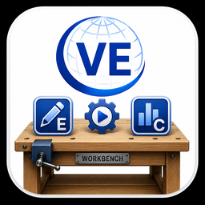

  

<h1 align="center">VisionEval Workbench Wiki</h1>

<strong>Build, run, compare, and explain repeatable VisionEval scenarios.</strong>

VisionEval Workbench is an unofficial desktop application that brings model inputs, scenario design, model execution, and completed-result comparison into one guided workspace.

> [!TIP]
> New to Workbench? Choose your platform below, complete its installation guide, and then follow the screenshot-driven scenario walkthrough.

## Choose your platform

| Platform | Runtime model | Start here |
|---|---|---|
| **Windows 11 x64** | Existing native `VE_Runtime`, `VE_HOME`, and compatible R installation | [Windows overview](Windows-Overview) |
| **Apple Silicon macOS** | Managed ARM64 runtime through Docker Desktop | [Apple Silicon overview](macOS-Overview) |
| **Intel macOS** | Managed AMD64 runtime through Docker Desktop | [Intel overview](Intel-macOS-Overview) |

## Core workflow

| 1. Explore | 2. Create | 3. Run | 4. Compare |
|---|---|---|---|
| Inspect inputs, definitions, units, and dependencies. | Preserve a baseline and create deliberate scenario overlays. | Prepare fresh model copies and execute verified jobs. | Review tables, charts, maps, changed outputs, and exports. |

## Popular destinations

- **Learn by doing:** [Tutorials and Walkthroughs](Tutorials-and-Walkthroughs)
- **Download Workbench and packages:** [Latest release](https://github.com/nikolasleeb/VisionEval-Workbench/releases/latest)
- **Install regional assets:** [Regional Packages](Regional-Packages)
- **Resolve a problem:** [Troubleshooting](Troubleshooting)
- **Report a problem or improvement idea:** [Open a GitHub Issue](https://github.com/nikolasleeb/VisionEval-Workbench/issues)

> [!NOTE]
> Windows uses a native VisionEval installation. Apple Silicon and Intel macOS use separate architecture-specific Docker runtimes. Always follow the guide that matches the computer running Workbench.
