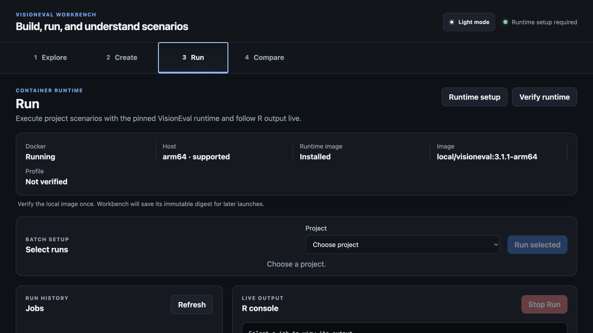

<!-- Generated by packaging/build_user_guide.py from docs/user. Do not edit this file directly. -->
# VisionEval Workbench User Guide

This repository copy is generated from the same Windows guide bundled with VisionEval Workbench 2.0.0.

---

## Overview

VisionEval Workbench 2.0.0 is a native Windows x64 desktop application for inspecting VisionEval inputs, designing repeatable scenarios and bounded Hypercubes, running them through a verified `VE_RUNTIME`, and analyzing completed datastores. It can connect to an existing installation or install the certified R 4.5.3 and VisionEval RC7 pair for the current user. Project data remains in the workspace you select.

The normal workflow has five parts:

1. **Explore** input files and model dependencies.
2. **Create** a baseline and edited scenarios.
3. **Run** VisionEval through the verified native runtime.
4. **Compare** completed datastores and maps.
5. **Hypercube** creates and analyzes bounded two-parameter experiments.

## How it works

- Workbench discovers or independently selects `VE_RUNTIME`, `VE_HOME`, and a compatible `Rscript.exe`; its optional managed installation requires no administrator privileges.
- Installed regional packages provide compatible model templates, InputLibraries, and map context.
- Saved scenarios record deliberate CSV changes and notes. Each run prepares a fresh model copy, applies the selected scenario, and preserves provenance.
- Windows jobs run one at a time through the native runtime. Workbench owns the prepared models, logs, and results in its workspace. A managed runtime installation occurs only after explicit approval and never places `VE_RUNTIME` inside `VE_HOME`.
- Successful datastores are registered for Compare. A disposable cache accelerates filtering, statistics, maps, and exports while the RDA datastore remains authoritative.

## Start here

- [Connect VE_Runtime](docs/user/setup.md)
- [Getting started](docs/user/getting-started.md)
- [Core concepts and glossary](docs/user/core-concepts.md)
- [Explore inputs and dependencies](docs/user/explore.md)
- [Create and review scenarios](docs/user/create-and-review.md)
- [Run VisionEval](docs/user/run.md)
- [Compare results](docs/user/compare.md)
- [Create, run, analyze, and export Hypercubes](docs/user/hypercube.md)
- [Settings, workspaces, and storage](docs/user/settings-workspaces-storage.md)
- [Units, rounding, and provenance](docs/user/data-units-provenance.md)
- [Troubleshooting](docs/user/troubleshooting.md)
- [Keyboard shortcuts](docs/user/keyboard-shortcuts.md)
- [Future improvements](docs/user/future-improvements.md)

## Before connecting the runtime

You can open Workbench, manage the workspace, explore installed inputs, create scenarios, and inspect already registered results. A verified native runtime connection is required to start a new VisionEval run.

## Your notes are safe

Workbench refreshes this managed guide during upgrades. Put personal documentation in `Documentation/User Notes/`; upgrades never replace those files.

---

## Connect VE_Runtime on Windows

Workbench can connect to an existing native VisionEval installation or install the certified R 4.5.3 and VisionEval VE-40-RC7 pair for the current user. The managed installation does not require administrator privileges.

## What you need

- Windows 11 x64 and VisionEval Workbench 2.0.0.
- A `VE_RUNTIME` working folder, normally containing `.Renviron`, `.Rprofile`, or a `launch_R*.bat` script.
- A `VE_HOME` package library containing the required VisionEval packages.
- A compatible `Rscript.exe`.

These three paths are validated independently. `VE_HOME` and `VE_RUNTIME` must be separate, non-nested folders. Workbench resolves junctions and symbolic links before accepting them, so an alias cannot hide an overlap.

## 1. Install Workbench

Download the Windows x64 artifact, extract it, and run the NSIS setup executable. Launch **VisionEval Workbench** from the Start menu.

## 2. Choose a workspace

On first launch, accept the suggested File Explorer-visible workspace or choose an empty folder that is separate from `VE_RUNTIME` and `VE_HOME`. The workspace holds projects, installed assets, prepared runs, logs, results, caches, and personal notes. Workbench remembers it on later launches. A folder on an external SSD is supported and is recommended when internal disk space is limited.

If an existing workspace was moved or disconnected, use **Open existing workspace**. Workbench never silently substitutes a different folder.

## 3. Connect or install the runtime

If Workbench finds no usable runtime, first-run setup opens automatically. Choose **Detect again**, select all three existing paths, or choose **Install R 4.5.3 + VisionEval RC7**.

1. Open **Settings → Runtime**.
2. Select **Choose VE_Runtime…** and choose the folder used as `VE_RUNTIME`.
3. Review the detected `VE_HOME` and `Rscript.exe` paths.
4. Expand **Detected paths and advanced overrides** only if either detected path is incorrect.
5. Select **Verify runtime**.

Verification starts that R installation and reports detected R, VisionEval, package versions, registered modules, release tag, and `VECommit`. VisionEval packages continue to report version 4.0.0, so Workbench uses `VECommit` to identify RC7 correctly.

The managed installer reuses a compatible R 4.5 installation when available. Otherwise it installs R 4.5.3 under the current user's local application directory, installs the RC7 library under `%USERPROFILE%\VE_Home`, and creates the working folder at `%LOCALAPPDATA%\VisionEval\VE_Runtime`. Downloads use pinned official URLs and SHA-256 values. A failed checksum, TLS error, interrupted extraction, or failed verification stops the installation and cleans incomplete VisionEval files.

For offline setup, obtain the exact files listed in `WINDOWS-RUNTIME-COMPATIBILITY.md`, verify their SHA-256 values, install R for the current user, extract the VisionEval library into a separate `VE_HOME`, and then select `VE_HOME`, `VE_RUNTIME`, and `Rscript.exe` in Workbench. Never place `VE_RUNTIME` below `VE_HOME`.

The Runtime page reports exactly which path failed when the working folder, package library, or R executable cannot be used. Correct that path and verify again.

## 4. Install regional assets

Open **Settings → Assets** and install the approved regional package with **Choose ZIP…** or **Choose extracted folder…**. A regional package supplies the InputLibrary and model template used by Create. Virginia MPO geography building requires the separately distributed Virginia region package.

Workbench copies installed assets into the workspace and never edits their source archive or the connected runtime.

## 5. Confirm the connection

1. Confirm **Native VisionEval ready** appears in the application header.
2. Open **Explore** and verify the installed InputLibrary loads.
3. Create or open a small project and save a scenario change.
4. Open **Run**, start the intended job, and confirm live R output appears.
5. After it succeeds, open **Compare** and select the registered result.

Windows runs are queued and execute one at a time. Successful results are registered only after the expected datastore is verified.

## Moving or upgrading VE_Runtime

If the runtime, package library, or R installation moves, return to **Settings → Runtime**, select all changed paths, and verify again. Workbench does not automatically adopt a newer R or VisionEval release until that pair passes the full certification suite.

---

## Getting Started

## First launch

Choose where Workbench should keep its workspace. Use the suggested location or an empty recognizable folder separate from `VE_RUNTIME` and `VE_HOME`. An external SSD is supported when internal space is limited. If a saved workspace is later moved or unavailable, Workbench asks you to locate it rather than creating a replacement.

## Runtime setup

When no verified runtime is available, onboarding opens automatically. Follow [Connect VE_Runtime on Windows](docs/user/setup.md) to detect or select the three independent paths, or choose **Install R 4.5.3 + VisionEval RC7** for a current-user installation. Administrator privileges are not required.

Choose **Skip for now** if you only need to inspect inputs, edit projects, or view existing results. A verified connection is required before a run can start.

## Install assets

New workspaces contain no regional data. Open **Settings → Assets** and install an approved regional package. Region Builder creates compatible model templates and InputLibraries; manual runnable-model importing is not required.

## Create your first project

1. Open **Create → Develop** and preview or build the required region assets.
2. Open **Create → Setup** and choose a project name, model template, and InputLibrary.
3. Choose an untouched baseline or a compatible completed baseline.
4. Create the project, open Editor, and add a scenario.
5. Save changes, open Review, and continue to Run when validation passes.

Entering Run never starts a job automatically.

## Window behavior

Workbench follows the usable Windows viewport when maximized, restored, moved between displays, or scaled. Pages remain scrollable and reserve a bottom safety gutter so final controls stay above the taskbar.

---

## Core Concepts and Glossary

## Assets and projects

**InputLibrary**  
A named collection of input CSV files. Workbench copies it during import and uses it as the original source for scenario edits.

**Model template**  
A validated, complete VisionEval model. It supplies configuration, module order, definitions, and base inputs. Every project uses one pinned template.

**Project**  
A comparison workspace that pins a model template and InputLibrary and contains a baseline, editable scenarios, and run/result references.

**Baseline**  
The reference scenario. A fresh baseline uses untouched project inputs. An existing completed baseline can be referenced, but Workbench warns when its provenance cannot be verified against the project.

**Scenario**  
A named set of saved file changes and notes. A scenario starts from the project's untouched inputs; only saved file changes are applied when it runs.

## Model execution

**Run / job**  
One execution of the baseline or a scenario. Each job has a state, log, runtime provenance, prepared model folder, and result verification.

**Batch**  
A group of selected jobs submitted to the Windows run queue. The native `VE_Runtime` adapter executes one job at a time in queue order.

**Runtime profile**  
The verified `VE_RUNTIME`, `VE_HOME`, `Rscript.exe`, detected R and VisionEval versions, registered modules, and verification date.

## Model data

**Input**  
A user-editable CSV field read by an executed module.

**Module**  
A VisionEval modeling step executed by the selected template's `run_model.R`.

**Intermediary**  
A datastore value produced by one module and consumed by a later module. It may remain stored in the final datastore.

**Stored output**  
A value available in completed results. An output may also be an intermediary.

**Dependency path**  
A declared route from an input through modules and datastore values to a reachable output. It shows a possible effect, not proof that every input change will alter every output.

**Datastore**  
VisionEval's structured results, including `DatastoreListing.Rda`. Successful verified datastores are registered in Compare.

## Geography

**Azone, Bzone, Czone, Marea**  
VisionEval geography levels defined by the selected model. Their meaning and relationships come from that template's `defs/geo.csv`.

**County filter**  
A convenience mapping from county labels to related Azone and Bzone values. It selects matching rows; it does not aggregate them into a county total.

---

## Explore Inputs and Dependencies

Explore has two subtabs: **Input File Library** and **Dependencies**.

## Input File Library

On a fresh install, Workbench shows built-in VisionEval input metadata so you can browse common input files before installing any package. After a package is installed, choose its InputLibrary for the model-specific file list and authoritative package details. Select a CSV file to see:

- The file's purpose and geography level.
- Field names, descriptions, data types, and display units.
- The metadata source and unresolved warnings.
- Longer explanations when a guide package is available.
- A link to view the file in Dependencies.

Built-in metadata is useful for orientation, but installed packages provide the actual model/InputLibrary files, package-specific fields, and explanation guides used by projects.

Check the selected model's documentation whenever its files or modules have been customized.

## Dependencies

Choose a dependency source before exploring dependencies. Workbench derives the network from an installed or imported model template when one is available. If no template is installed, a completed run may provide enough model context for a dependency source; otherwise run a scenario or install/import a model template first.

The network opens as a compact, ordered overview of the executed modules. Drag its background to pan, scroll or pinch to zoom, and use **−**, **+**, **100%**, or **Fit** for precise control. The minimap shows which part of the model is visible. Search centers an overview node; press Return to focus any matching input, table, file, module, or package.

You can focus by input file, input field, executed module, datastore intermediary, or stored output. File and field focus answer “what reads this selection directly?” and separate the selected source, modules using it, and values those modules write. When you click a module, Workbench keeps the **Selected path** first. Use **Full module context** to add every other file column and earlier model value the module reads. Breadcrumbs preserve each step you follow.

Focused module lanes describe roles in the selected operation: **Source files**, **Values read** (separated into file columns and prior model values), **Selected module**, and **Values written**. A value stored elsewhere in the model appears under prior model values when it is being read here. Values written counts only direct outputs of the selected module. Equivalent file-input and datastore-read declarations are displayed once.

Modules chosen directly from the toolbar or search open in full module context. Modules reached from a file or field offer both scopes. **Show Full Model** returns to the ordered overview.

Intermediaries and stored outputs open in **How produced**. This view shows the selected value’s one exact producing step: the producer’s direct files, columns, and earlier values, the producing module, and only the selected value. Select an earlier value to continue tracing upstream without opening hundreds of nodes at once. **Where used** shows only later modules that directly read the selected value; the producing module is never mixed into that list. Framework values with no declared producer open in **Where used** and state that their source was not declared.

Use **SVG** to save a single infinitely scalable canvas. **PDF** creates a vector document; large full-model graphs are tiled across readable landscape pages while focused paths normally fit on one page.

In the full overview, colors and labels distinguish:

- Scenario inputs.
- Executed modules.
- Datastore values/intermediaries.
- Stored outputs.
- Unresolved custom modules.

An input file may be installed but unused by the selected model. Workbench labels it **Not used by this model's execution path** instead of creating a relationship.

## Reading the network correctly

A path means an executed module declares that it reads the input or datastore value and a downstream producer/consumer relationship exists. It does not measure sensitivity, prove causation, or guarantee a numerical result change.

In a focused module view, **Values from earlier steps** are datastore values the selected module reads. When the graph knows the producing step, the value is labeled **From _number_. _ModuleName_**. Values without a preceding declared `Set` are labeled **Loaded earlier — source not declared**; Workbench does not invent a producer for framework-initialized values. These labels describe model execution lineage and do not require the user to change scenario inputs.

After running scenarios, Compare provides observed evidence about which outputs actually changed.

For implementation details, module source, and the broader VisionEval project, see the [official VisionEval User Guide](https://visioneval.github.io/docs/) and [official VisionEval repository](https://github.com/VisionEval/VisionEval).

---

## Create and Review Scenarios

Create opens on **Setup** and also provides **Develop**, **Editor**, and **Review** subtabs. While Workbench remains open, each of the four main sections remembers its last nested view and scroll position, so returning to Create takes you back to the Editor, Review, or other Create view you were using. This session navigation memory resets to the normal defaults after the application quits. Explicit workflow actions still take you directly to the relevant subtab.

Opening **Develop** starts preparing map geometry from an eligible installed model or regional package in the background. The status beside **View map** indicates whether geometry is being prepared, ready, cached locally, or needs a retry. A first load uses the package's official geometry services; later loads can use the local cache.

## Develop a packaged region

Develop creates a matched InputLibrary and runnable model template. It can use an installed regional data package, or an eligible model package such as PlanRVA to build a smaller subregion contained within that model. When neither kind is installed, Develop shows an **Install package** action.

1. Install a model or regional package ZIP supplied for the area you need.
2. Choose the Develop source and region or installed-model scope.
3. Review the package's source links, source-check date, and source notes.
4. Review or edit the region name and state abbreviation. Workbench derives the internal VisionEval region code from the name.
5. Select **Preview region**.
6. Review the selected Azone and Bzone counts, boundary cases, copied/defaulted files, and warnings.
7. Select **Build region assets** only after the preview is acceptable.
8. Continue to Setup and create a project from the generated InputLibrary. Its paired template is selected automatically.

With only the PlanRVA model package installed, Develop exposes the eight localities and 749 Bzones actually contained in PlanRVA. You can build a smaller selection from those Bzones, but unrelated Virginia geography is not displayed or selectable. Install the separate Virginia regional package to build other Virginia MPOs or planner-defined regions outside PlanRVA.

The package's official region is the default, not a locked boundary. Select **Customize** under Geography to add or remove whole Azones or individual Bzones before previewing. A CSV may contain an `Azone` column, a `Bzone` column, or both. Azone values may be locality names or five-digit FIPS codes; Bzone values are full GEOIDs. The import replaces the dialog's current draft and is validated against the selected MPO's participating localities.

Virginia statewide geometry remains available as supporting map context where the installed package provides it. Workbench does not offer a full-state Virginia runnable build in this release because the statewide input set has known execution limits in VisionEval.

Custom geography is written to the generated manifest with the final Azone/Bzone lists and the Bzones added or removed relative to the official package selection. **Restore official** resets the draft at any time before previewing.

Each package is independent. Installing a package for another state adds that package's terminology, regions, inputs, crosswalk, and provenance without changing or requiring the Virginia package.

### Virginia MPO package

The separately built **Virginia MPO Regional Data** package contains the statewide Virginia InputLibrary, all 15 MPO definitions, and a versioned spatial crosswalk between official VDOT MPO Study Areas and Virginia VisionEval Bzones. The collapsed **Data sources** section records the official source links and the date those sources were checked without interrupting the region workflow.

A Bzone is included when its representative point is inside the MPO or at least half of its area overlaps. Bzones below 99% overlap are reported as boundary cases in the preview and build manifest. If the crosswalk does not match the package InputLibrary, Workbench reports the mismatch instead of mixing source versions.

The generated boundary is accurate to complete Bzones, not an exact clipping of the MPO polygon. Workbench does not split a Bzone that crosses the official boundary. Azone and Marea input rows also remain whole-locality values, and region/non-spatial files are copied unchanged. Treat those inputs and any generated defaults as modeling assumptions requiring review before policy use.

Use **View map** to inspect all Virginia MPO outlines, Azones, and Bzones. The map's MPO menu is exploratory: choosing an MPO highlights its official study area, selected Bzones, and included or excluded boundary cases without changing the Region Builder selection. Select any visible MPO, Azone, or Bzone to inspect its identifiers, locality, MPO memberships, current-MPO status, and recorded boundary overlap. **Zone ID labels** adds collision-reduced Azone IDs at MPO scale and Bzone IDs at close scale. Drag to pan, use the wheel or `+`/`-` controls to zoom, select **Fit MPO** to restore the review extent, or select **Virginia** to return to the statewide extent. Azones represent whole Virginia localities and can extend well beyond an MPO study area.

The first statewide map view retrieves simplified geometry from the official ArcGIS services and caches it in the local workspace. Later views use that versioned cache. Previewing and building a region use the packaged crosswalk and remain available offline even when map geometry has not been downloaded.

## Setup

Setup imports assets, creates projects, and manages saved and archived projects. The baseline is part of the project and remains read-only in the Editor.

An existing completed baseline is available only after a verified compatible baseline has run successfully with the same Model package and Input Library. Failed, missing, unverified, or incompatible results cannot be selected as a project baseline.

Setup creates Standard scenario projects for ordinary scenarios, Batch Change, and single-file editing. Hypercube projects are created only from **5 Hypercube → Build** and contain one parameter matrix plus its generated cases.

A Hypercube matrix can be replaced only before any generated case has been submitted to Run and before the project has results. After that point, create a new Hypercube project for a revised matrix. Copying the full project preserves its Hypercube type. Copying an individual generated case into a Standard project turns the case into an ordinary standalone scenario.

Saved Work cards expand independently, so several projects can remain open while you compare their scenarios and completed results. Result labels follow the current project and scenario names; the names recorded when a run or copy occurred remain preserved as provenance. **Copy Project** and **Copy Scenarios** create independent copies of every verified completed result that applies to the copied content, including older result versions. Result files are copied into the destination project; run logs and run history are not. Deleting the source therefore cannot break the copy. Workbench estimates the required storage, checks available disk space, and shows cancellable progress before publishing the copy atomically. A project with an unfinished run remains visible but unavailable as a copy destination until every run in that project finishes or is stopped.

After a copy, **Review Runs** opens Run with only copied scenarios that are missing results or whose inputs have changed. Workbench never starts a run as a side effect of copying.

Removing a project archives it for 30 days. Archived projects, jobs, and results disappear from normal Create, Run, and Compare lists. Restore reactivates it; Delete Now permanently removes eligible data. A project with active or waiting jobs cannot be archived.

For a Standard project, the trash button beside a scenario opens a compact summary of the saved files, terminal runs, logs, completed results, and storage that will be removed. Confirming permanently removes that scenario and its project-owned artifacts. Results still referenced by another active or archived project are retained and marked as having a removed source scenario. A scenario with an unfinished run cannot be removed. Generated Hypercube cases cannot be removed individually because doing so would invalidate the matrix.

## Editor workflow

The sidebar represents the project:

1. **New Scenario** creates an editable scenario container and opens Batch Change with clean controls. Scenario names are unique without regard to capitalization, so `Scenario A` and `scenario a` cannot coexist in one project. Its suggested name is the lowest unused `Scenario N` name; duplication and cross-project copies resolve conflicts with the next available copy suffix using the same case-insensitive rule.
2. **New File** opens one input CSV inside that scenario and clears file-dependent controls until a file is selected.
3. Repeat New File for other individual inputs.
4. Use **Batch Change** when the same operation should affect several input files.

**Copy Scenario** makes a same-project copy of its saved file changes, scenario note, and file notes. The copied notes are independent of the source. Batch-only copies reopen in Batch Change, single-file copies reopen the copied file, and mixed copies preserve the current editing mode when possible.

### Single-file mode

Choose locations, target year, editable columns, an operation, and a value.

- **Apply and Save Change** calculates and saves the selected operation in one atomic action.
- If the operation targets cells already adjusted from the untouched baseline, choose **From baseline** to replace the targeted cells using untouched values, **Apply additional operation** to compound from current scenario values, or **Cancel**.
- Direct table-cell edits remain separate; **Save Direct Edits** persists them explicitly.
- **Revert Direct Edits** returns the table to the last saved version.
- Undo and Redo affect unsaved direct table edits.
- Removing a saved file from the sidebar restores the scenario to the original InputLibrary file.

Direct table edits remain temporary until saved. Workbench prompts before you leave a file, scenario, project, or subtab with unsaved work. **Ctrl+S** saves direct edits when a dirty file is open.

The table keeps saved scenario differences visible after reopening a file, including files created through Batch Change. Light yellow cells are saved changes from the original InputLibrary baseline. Darker yellow cells with an inset outline are additional unsaved preview changes. Saving converts the darker preview state to the saved-change state; Review remains the complete before/after audit.

Selections are remembered separately for each scenario and file, including after restarting Workbench. If no working selection has been saved locally, the Editor reconstructs one from recorded saved operations. When prior edits used different operations, amounts, or location scopes, the controls show **Mixed** and require a specific choice before another change can be applied. **Clear selections** clears only these controls; it does not remove saved scenario changes.

### Batch mode

Select one or more files and fields, then use the same geography, year, operation, and value controls. **Apply and Save Batch Changes** persists the changes immediately. Files that cannot represent the selected geography are listed and skipped before you confirm. In **Choose the starting values**, leave **Start this batch from the untouched baseline** off to apply the operation on top of current scenario changes. Turn it on to replace earlier changes only within the selected files, columns, year, and locations using untouched baseline values. Apply controls are disabled while work is in progress so a rapid repeated click cannot submit the same operation twice.

The Notes panel stays at the top of the active workspace and shows only the note relevant to the current mode: the scenario note in Batch Change, or the selected file's note in single-file editing. Both note types save automatically after a short pause or when you leave the field, without saving pending CSV changes.

Compact provenance emblems identify **Batch change**, **Single-file change**, or **Batch and single-file changes** in Editor, Review, and Setup → Saved Work. Hover or move keyboard focus to an emblem for its full label. Existing changes without source metadata are never guessed and show no emblem.

Hypercube projects now live in the primary **5 Hypercube** workflow rather than Create. Use its Build, Review, Run, and Analyze subtabs; see [Hypercube workflow](docs/user/hypercube.md).

## Geography selection

Location options come from the project's model-template definitions. County selection begins empty; select specific counties or explicitly select all. For PlanRVA, county choices map to county-named Azones and related Bzones.

**All locations** is an explicit unfiltered mode. County mode requires at least one county.

## Review

Review compares each saved scenario file with its original InputLibrary source. It shows changed files, rows and cells, geography, years, before/after values, notes, and validation warnings.

Use **Active project** in the Review toolbar to inspect another project without returning to Setup or Editor. The Editor and Review project selectors share the same active project.

Each scenario also has a deterministic **Automatic summary** generated locally from its saved edit operations and complete before/after differences. It does not use an LLM. Review shows the compact headline directly on the collapsed scenario card; expand the scenario and then **Automatic summary** to see the hierarchical per-file details. When several calculated operations affect one file, Review lists them separately in application order because later operations use the current scenario values. If validated operations explain only part of the saved result, Review follows them with **Other saved changes** derived from the actual differences. Automatic summaries appear only in Review and remain separate from editable scenario and file notes. Each saved file also has a collapsed **Changed-row audit**. Expanding it shows only affected CSV rows and variables; every highlighted cell includes its baseline and saved scenario values.

Continue to Run is disabled when required files, schemas, geography, or model configuration are invalid. It opens Run with the reviewed project/scenarios preselected but does not start VisionEval until the run is confirmed.

Batch Change selections are remembered independently for each scenario. Returning to a scenario restores its local working selection or reconstructs the combined selection from its recorded batch operations.

---

## Run VisionEval

Run prepares and executes selected baselines and scenarios through the saved native runtime profile.

## Before running

Run requires a verified `VE_RUNTIME`, compatible `VE_HOME` and `Rscript.exe`, a valid project, and saved scenario changes.

## Queue

Windows runs one job at a time. Selected baselines and scenarios enter a shared queue. Waiting jobs show their queue position and can be reordered; an active job cannot move.

## History and live output

Run History groups the active job first, waiting jobs in queue order, and completed history afterward. Live Output automatically follows the running job whenever the queue advances. You may select another tab to inspect its log; when the next job starts, the console follows that new active job and resumes tail-following.

Each job keeps its own output. Scroll upward to pause follow-tail. Complete output remains in the job's `run.log`.

## Stopping

**Stop Run** ends the selected active R process, releases the runtime slot, and removes partial prepared output. Waiting jobs can be removed without affecting the active process.

If cleanup cannot finish, **cleanup failed** remains with **Retry Cleanup**. The result is not registered until a successful run has produced and verified its datastore.

## Closing Workbench during a run

Choose **Stop Runs and Quit** to end Workbench-owned R processes and clean their partial files, or keep Workbench open. Workbench does not terminate unrelated R processes. Waiting jobs remain queued for the next launch.

## Successful results

After VisionEval exits successfully, Workbench verifies `results/Datastore/DatastoreListing.Rda`. Only then does the result become available in Compare.

---

## Compare Results

Compare shows observed differences between completed or previously registered Datastores. Its **Compare**, **Map Visualization**, and **Percent-Change Chart** views each have independent result selectors and retain their own state. Hypercube response analysis lives in **5 Hypercube → Analyze**; a selected Hypercube case can open directly in Map when the output supports geography.

## Choose results

Choose a reference and optional comparison in the same control panel as Table, Variable, Year, Rows, and geography. Map and Percent-Change Chart have their own selectors. An uninitialized view inherits the last valid pair, but later changes stay local to that view. Reference-only Compare provides variable explanations, geography filters, sorting, paging, statistics, and reference exports. Ordinary selectors show standard and imported results, not individual Hypercube cases.

New results are registered when Workbench runs complete. Results imported by an older Workbench version remain selectable as read-only legacy records, but Compare no longer imports or manages external result folders.

Archived project results are hidden from normal selection. Hypercube cases stay in Hypercube Analyze rather than appearing as ordinary Compare selections.

## Compare values

Choose a table, variable, common year, row count, and optional geography filter. Workbench safely aligns rows by stable identifiers rather than assuming that row positions match.

Workbench builds a disposable fingerprinted inventory and SQLite value cache from the authoritative RDA datastore. The inventory records tables, variables, years, types, and geography keys after one tree walk. Repeating a selection is normally immediate. The activity bar reports metadata, geometry, calculation, and drawing phases; completed activity uses a stationary checkmark.

Available analysis includes:

- Changed-row counts.
- Total percent change for numeric outputs.
- Rows-changed percentage for categorical outputs.
- Increased/decreased counts, net change, average-row percent, and distributions.
- Optional red/green directional deltas.
- Changed-rows-only filtering and pagination.
- Three-state column sorting: original, ascending, descending, then original.

Numeric values display at up to five decimal places. Geographic and entity identifiers are never rounded.

## Geography filters

Detailed comparisons, changed-output discovery, percent-change charts, and selected-location exports each have an independent location selector. A location change marks the affected result stale until its action is run again.

County filtering uses the result's model-template `defs/geo.csv` to map county labels to Azones and Bzones. Household, Vehicle, and Worker rows are included when their stored location belongs to a selected county in the reference or a comparison. County filtering is disabled for purely regional outputs that cannot be mapped safely.

## Find All Changes

- **Find All Changes** scans every comparable output across the selected results; it is independent of the Table and Variable used by the detailed comparison.
- Each numeric result reports the total percent change in the variable's summed value relative to the reference.
- **All locations** scans every location. **Selected locations** opens an independent cross-output location selector.

The activity strip shows phase, elapsed time, completion/failure, and Stop when cancellation is supported. A cold scan loads each datastore once and caches its safely keyed statistics. Repeating the same roles, data, year, and geography can use the cache.

Unsafe unknown multi-row tables and variables whose value count does not match the table's stable keys are skipped with a reason instead of reporting misleading row-position changes. One skipped variable does not stop discovery from scanning the remaining outputs.

## Chart and exports

**Map Visualization** shades package-defined geographies. The Virginia package offers **County / locality** (the package's Azone county-equivalent geometry) and **Bzone**. Technical metadata and exports retain the Azone identifier so the model geography remains explicit. Future state packages can expose County only when they provide an authoritative mapping.

Direct Azone and Bzone fields are preferred. Household and Worker outputs use their stored geography. Vehicle Bzones are derived independently in each result through `Vehicle.HhId -> Household.HhId -> Household.Bzone`; vehicles without a unique household match are counted as excluded rows. Every mapped numeric row contributes equally to the geographic mean, matching Workbench's ordinary Mean summaries rather than restricting calculations to entity IDs matched across scenarios.

The default display is Change %. Zero-to-zero is 0%; a nonzero comparison with a zero reference has no defined percent and uses the unavailable hatch. Change metrics use a symmetric diverging scale centered on zero and sized to the largest visible absolute change. Reference and comparison metrics use the visible minimum and maximum. A square-root perceptual ramp gives every nonzero value a visible tint while preserving sign and value order; exact zero stays neutral. Map fills, sampled legends, inspectors, 2D/3D views, and exports use the palettes saved in Settings. **Map value labels** shows the active metric at useful zoom levels; it can be combined with zone IDs. Metric, MPO focus, layers, labels, zoom, and pan redraw the generated snapshot without recalculation. The map supports PDF, PNG, SVG, CSV, and Excel exports; visual exports preserve the current viewport and data exports preserve the current statewide or selected-MPO scope.

For PlanRVA Marea outputs, Workbench visually dissolves the contributing Bzones into exactly two clean, selectable logical regions: **Richmond UZA** and **Non-UZA**. Internal Bzone edges are hidden; a zero-valued region remains visible with a neutral fill, outline, label, and displayed zero. Inspector details and data exports retain the technical Marea ID and contributing Bzone provenance. The Virginia state outline remains visible beneath the value layer in 2D and 3D even when optional context layers are hidden.

**Percent-Change Chart** displays a diverging horizontal bar chart for several numeric variables with a common year and its own optional location filter. Bars left of zero are decreases from the reference and bars right of zero are increases. After **Generate chart** finishes, Sort and Display controls immediately transform the cached result without rerunning the calculation.

## Hypercube drilldowns

From **5 Hypercube → Analyze**, select a matrix cell to inspect that case immediately or select two cells for an in-place difference. **Open Map** preserves the selected case and output and routes spatial results into Map. The removed general Compare and curve handoffs are not shown. See [Hypercube workflow](docs/user/hypercube.md) for cached response matrices, Find All Changes, scenario rankings, and exports.

**Export data** offers four products. **All Locations Changed Outputs** and **Selected Locations Changed Outputs** contain one row per changed output with a Change % column for each comparison. **Current View** contains every matching row for the active variable, comparison location scope, and sort order, not only the displayed page. **Full Variable Data** exports every row for one or more comparison-compatible outputs in original order and ignores active location filters. Its CSV option creates a ZIP with one CSV per output; its Excel option creates a workbook with separate variable sheets and an index. The Windows **Export** menu exposes the same products.

Excel workbooks add frozen and filtered headers, typed values, readable widths, neutral delta highlighting, statistics, and a provenance sheet. Provenance records datastore IDs and fingerprints, year, table, variable, units, geography filters, five-decimal comparison precision, generation time, and Workbench version without exposing workspace paths. Large datasets are split across numbered sheets rather than truncated. Workbook generation is reconnectable and cancellable from the Compare activity strip.

---

## Hypercube Workflow

Open primary tab **5 Hypercube** or press **Ctrl+5**. Hypercubes are safe to run on a laptop, but Windows runs one VisionEval case at a time, so larger matrices can take many hours and use substantial memory and workspace storage. On computers with less than 16 GB of RAM, use small matrices and close other memory-intensive applications. This is guidance, not a blocker. Version 2 limits Hypercubes to two parameter axes and 400 cases to keep experiments bounded.

## Build

Create or select a Hypercube project, then configure one or two numeric parameter axes. An interval must be at least 2, each axis may contain at most 20 generated values, and a new or replacement definition may contain at most 400 cases. Existing older matrices remain runnable and analyzable even if they exceed those limits, but an out-of-policy replacement is rejected.

Setup changes save automatically without creating cases. **Saving…**, **Saved**, and **Not saved—Retry** report the draft state. Preview uses the latest saved revision and shows every generated value, exact case count, shared row scope, estimated serialized runtime, and retained disk. Only **Generate Scenarios** creates or replaces cases.

The project name is the matrix name. Shared year selects dated input rows; it does not change model years. **All matching rows** applies each combination to every compatible row without adding a location dimension. A specific geography requires at least one location. Before a run, Workbench shows detected RAM, workspace free space, case count, serialized execution waves, estimated elapsed time, and retained storage when available. If retained data plus a safety reserve is larger than free workspace space, Workbench asks for confirmation; RAM alone never blocks creation or execution.

## Review

Review shows the immutable generated definition, axes and values, case count, year, geography, scope, model provenance, and a current resource estimate.

## Run

Choose the project rather than dozens of individual scenarios. **Run Missing** queues only a missing baseline and missing cases. **Retry Failed** queues only failed work. Successful work is not routinely rerun. The batch card reports totals, progress, elapsed time, estimated remaining time, waves, and the single active native slot. Completed elapsed time is frozen at the latest terminal job instead of continuing to advance. **Stop This Hypercube** removes its waiting jobs and stops its owned active R process tree without disturbing unrelated batches. Normal Run history shows one compact Hypercube card; detailed case logs remain here. A completion notification is sent for the project rather than for every case.

A 9 × 9 matrix creates 81 cases, 81 serialized execution waves, and takes about 15 hours under the current planning assumption. A future verified container or cloud execution engine could support parallel cases, but parallel execution is not available in Windows 2.0 and is not promised for a particular release.

New Hypercube runs retain the authoritative Datastore and skip the optional full CSV export tree.

## Analyze

Choose an actual VisionEval output table and variable, year, optional geography, aggregation, and metric. Aggregation is an explicit analytical choice: Sum measures totals, Mean measures the arithmetic average, Median measures the middle row or location, and Minimum or Maximum shows an extreme. Two axes render as a labelled response matrix with one cell per case; Scenario ranking provides the sortable alternative view. Fingerprinted matrices are cached. Selecting one or two cells updates details immediately from the existing matrix without recalculating it. Available metrics include result value, absolute and percent change from baseline, typical row change, and breadth. Zero-reference percent changes are unavailable rather than infinite. Household, Vehicle, and Worker identifiers are run-local, so Find All Changes uses aggregate distributions rather than unsafe individual matching.

Analysis state remains in memory while you visit other Workbench tabs. Active matrix and discovery operations keep the previous result visible, lock request-changing controls, show phase, case/table progress, elapsed time, heartbeat, bytes read, summaries written, and cache growth, and provide **Cancel**. The primary Hypercube tab pulses while work continues elsewhere. Completion or failure notifies you off-screen. Restarting Workbench resets the visible analysis session but retains safe fingerprinted summary checkpoints.

**Find All Changes** is the Hypercube-wide equivalent of the Compare operation. It has its own Year and Aggregation controls, independent of the single-output Response Matrix. Median is the default; Sum, Mean, Minimum, and Maximum are also available. It runs only when you press the button, reads each baseline table once, processes every verified completed case, and checkpoints after each case/table. Large or uncached scans can take several minutes. It is cancellable, sends one completion or failure notification, and repeating an identical project/year/aggregation request restores the fingerprinted result cache. Results can be searched and ranked by overall shift, typical row shift, breadth, or extreme change. Select an output to open its scenario-ranking side panel without another scan, or use the Scenarios view to rank cases across all eligible outputs. Keyboard-focusable help explains both tables, and rankings measure sensitivity rather than desirability. No opaque combined score is used. Response matrices are also fingerprinted and reused until their request or underlying Datastores change. All cached material shares the disposable comparison-cache limit.

Select one cell for its details or two cells for an in-place difference. **Open Map** sends the selected case and output to the spatial view. Export the displayed analysis—not the complete result tree—as PNG, SVG, PDF, CSV, or Excel.

The storage card reports completed cases, authoritative Datastores, and disposable analysis-cache files. Hypercube runs do not create persistent full CSV trees.

## Export

Use **5 Hypercube → Export** to choose the common baseline or up to three verified completed cases per batch. Workbench queues each item separately in the app-wide FIFO export queue, generates output CSVs temporarily from its Datastore, and opens one save dialog per ZIP. The activity panel reports the current case and package position, preparation, CSV generation, compression, save-dialog state, cleanup, elapsed time, heartbeat, artifact size, and queued count. Each ZIP contains the complete resolved input CSV set, generated output CSVs, and a manifest with project, case, axis, runtime, and fingerprint information. It never includes the Datastore. Temporary generated CSVs are removed after success, cancellation, or failure, and later packages continue if one item is cancelled or fails.

---

## Settings, Workspaces, and Storage

Settings uses a fixed desktop sidebar for Workspace, Assets, Appearance, Numbers, Notifications, Runtime, Resources, Diagnostics, Documentation, and Storage. Only the selected page scrolls. The dialog leaves a visible gap above the Windows taskbar and white space beneath **Save Settings**.

Open Settings with the gear button or **Ctrl+,**.

## Save and refresh

**Save Settings** keeps Settings open and reports the actual result in the footer. Ordinary preferences show **Settings saved and applied.** A verified `VE_Runtime` connection that the running backend has not adopted yet offers **Refresh Workbench**.

Refresh restarts only Workbench's local backend, waits for it to become healthy, and reconnects the same native window. It is unavailable while a run is queued, preparing, running, exporting, or stopping. Close remains the only normal control that closes Settings.

## Diagnostics

**Settings → Diagnostics** lists failed runs and recent application errors. Exported diagnostic ZIPs include logs, manifests, native runtime/profile information, and app errors. Optional result-datastore and comparison-cache inclusions are off by default because they can be large.

## Documentation

**Settings → Documentation** displays this managed Windows User Guide without leaving Workbench. Guide home and Reload appear above the page. Internal links and bundled images remain in the viewer; external links are explicit. Upgrades refresh managed files but never replace `Documentation/User Notes/`.

## Workspace

The workspace contains `Projects`, `Assets`, `Results`, `Documentation`, and internal `.workbench` state. Use **Open another workspace…** or **Move workspace…** to change it safely. Back up the complete workspace when you need a portable copy.

**Forget** removes only a saved shortcut. **Move to Recycle Bin** is offered only for an inactive verified workspace and never for the current workspace.

## Assets

Install approved Workbench packages from Assets. Regional packages provide matched model-template and InputLibrary assets. Workbench blocks removal while a project references an asset. Removed unreferenced assets remain recoverable for 30 days.

## Appearance and numbers

Appearance controls theme and accessible decrease, neutral, and increase palettes. The optional master palette applies one set everywhere while retaining individual choices. Number settings control calculation and display precision without changing authoritative raw values.

## Runtime and resources

Runtime shows the independently selected `VE_RUNTIME`, `VE_HOME`, `Rscript.exe`, R and VisionEval versions, RC7 commit provenance, verification result, managed-install progress, cancellation, and repair actions. Re-run verification after any path or installation change. The runtime/home folders may not be equal or nested.

Windows executes one VisionEval job at a time. Resource guidance reports detected RAM and workspace capacity. Less than 16 GB of RAM is an advisory for smaller Hypercubes, never a technical block.

## Storage

Storage reports datastore, full-export, prepared-model, asset, project, cache, and total workspace sizes. The comparison cache is disposable: clearing or rebuilding it never removes registered results.

---

## Units, Rounding, and Provenance

## Input metadata

Workbench chooses an input display unit in this order:

1. A year or scale written in the exact CSV column header.
2. The selected model template's `defs/units.csv`.
3. The executing VisionEval module specification.
4. The human-written explanation guide.

The selected label does not erase disagreements. Explore displays a warning when sources conflict or remain ambiguous.

## Outputs and intermediaries

The producing module specification is the effective source because output columns do not have an input-file header. Disagreements with consuming modules remain visible.

Known items requiring review include D1B, OwnCostPerMile, some rate denominators, and road-cost currency fields. Workbench does not guess missing denominators.

## Rounding

Workbench rounds displayed numeric measurements to five decimal places. It does not change the underlying datastore or exported value.

Geo, Azone, Bzone, Czone, Marea, household, vehicle, and worker identifiers are treated as unitless strings. They are not rounded even when they contain only digits.

## Provenance

Projects record template and InputLibrary identities and fingerprints. Runs additionally record the project/scenario, app/runtime versions, image digest, timestamps, exit status, and result verification. Compare shows this provenance beside selectable results.

An external baseline without matching provenance remains available as a read-only imported result, but cannot be selected as a project baseline because Workbench cannot prove that its assets match the project.

---

## Troubleshooting

## A control is hidden behind the Windows taskbar

Maximize or restore Workbench once, then reopen the page or dialog. Workbench recalculates the visual viewport after resize, display scaling, and application zoom changes. If clipping remains, record the display scale, Workbench zoom, and window size.

## The app cannot find my workspace

Choose Retry if the location is temporarily unavailable. Choose **Open existing workspace** if it moved. Creating a workspace starts empty and does not recover the old one.

## Runtime verification fails

Open **Settings → Runtime** and check all three detected paths:

- `VE_RUNTIME` must be the working folder used to launch VisionEval.
- `VE_HOME` must be the compatible VisionEval package library.
- `Rscript.exe` must belong to the matching R installation.

Use advanced overrides only when automatic detection is wrong, then select **Verify runtime** again. The diagnostic details include the failing command and detected package versions.

After a successful path change, select **Refresh Workbench** in the Settings footer so the local backend reconnects with the verified `VE_Runtime`. Refresh is intentionally blocked until all queued and active runs reach a terminal state.

## Refresh Workbench fails

Settings keeps the error visible and does not close. Confirm there are no waiting, preparing, running, exporting, or stopping jobs, then retry. If reconnection still fails, close and reopen Workbench and export a diagnostic bundle from **Settings → Diagnostics**.

## Run does not become available

Confirm the header says **Native VisionEval ready**, all project changes are saved, Review passes, and the selected model template and InputLibrary belong to the same regional package.

## A project does not appear in Run or Compare

Restore it if archived. Only verified successful runs appear in Compare; failed, stopped, and partial results are excluded.

## A scenario change is missing

Apply Preview is temporary. Return to the file and select **Save File Changes** or press **Ctrl+S** before Review and Run.

## Map Visualization opens with empty selectors

This is intentional in a fresh session. Choose two distinct registered results. Compatible tables, variables, years, and geographies load after the pair is valid; geometry loads only after **Generate map**.

## The Virginia button does not move the 3D map

The Virginia action uses packaged statewide Azone bounds independently of whether context layers are visible. Install the current build and regenerate the map if an older build does nothing. **Virginia** preserves pitch and bearing; **Reset view** restores the default project camera.

## 3D geography is unavailable

3D requires WebGL and the bundled offline MapLibre renderer. Restart Workbench after updating the graphics driver. The complete 2D map remains available.

## Export is outside the comparison card

Install the current build. Its responsive header wraps controls within the card and opens the Export menu inward.

## Stop leaves “cleanup failed”

Select **Retry Cleanup** after confirming the Workbench-owned R process has ended. No result is registered while cleanup is incomplete.

## Documentation warning

Restart Workbench to retry the managed guide installation. Files in `Documentation/User Notes/` remain untouched. Preserve the workspace and report the exact warning if it continues.

---

## Windows Keyboard Shortcuts

| Shortcut | Action |
| --- | --- |
| Ctrl+N | New Scenario |
| Ctrl+Shift+N | New File |
| Ctrl+Alt+B | Batch Change |
| Ctrl+S | Save File Changes |
| Ctrl+Shift+R | Review / Run Selected; always opens confirmation |
| Ctrl+. | Stop Selected Run |
| Ctrl+1 | Explore |
| Ctrl+2 | Create |
| Ctrl+3 | Run |
| Ctrl+4 | Compare |
| Ctrl+R | Refresh |
| Ctrl+, | Settings |

Commands that do not apply to the current project, file, or job are disabled. Ctrl+S saves only the open file preview and its note; it does not save a batch or start a run.

Comparison labels, legends, and tooltips communicate direction without relying only on color: `▲ +` means increase, `▼ −` means decrease, and `•` means neutral. Solid elevated borders identify increases and dashed elevated borders identify decreases.

---

## Future Improvements

Potential Windows Workbench improvements include:

- Broader automated validation across supported `VE_Runtime`, R, and VisionEval version combinations.
- More regional packages with validated model templates, InputLibraries, and map context.
- Faster cold comparison scans and more detailed cache diagnostics.
- Clearer native-process memory, workspace-growth, and slow-phase guidance.
- Additional accessible comparison-map exports and inspection tools.
- Expanded recovery testing for interrupted native runs and moved workspaces.
- Safely turning supported VisionEval modules on or off for a model or project, where feasible, with dependency checks, required-input validation, and protection against invalid model configurations.
- Module explanations sourced from and version-linked to the official VisionEval GitHub documentation, matched to the connected VisionEval release.
- Increased error handling with clearer actionable messages, recovery guidance that preserves application state, and more useful diagnostic bundles.
- Evaluate automatically selecting or removing editing-year controls once model-package metadata can identify the intended editable year without ambiguity; keep explicit year selection until then.

These are roadmap items, not promises for a particular release.
