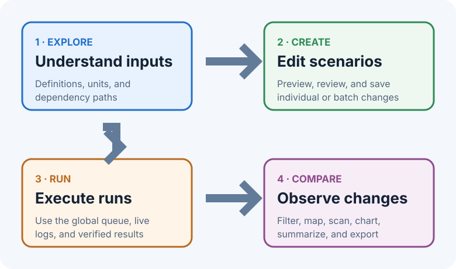

# VisionEval Workbench User Guide

VisionEval Workbench 1.0.0 is a local desktop application for learning a VisionEval model, designing repeatable input scenarios, running those scenarios in an isolated Docker runtime, and comparing the resulting datastores. It is intended to make the full scenario workflow inspectable without editing model folders by hand.

The normal workflow has four parts:

1. **Explore** input files and possible model dependencies.
2. **Create** a baseline and edited scenarios.
3. **Run** VisionEval through the verified Docker runtime.
4. **Compare** completed datastores to see what actually changed.

## How it works

- The native macOS shell starts a local backend and displays the Workbench interface. Project data stays in the workspace you select.
- The standard app starts without model or regional-data packages. Verified PlanRVA and Virginia packages can be installed independently from **Settings → Assets** using **Choose ZIP…** or **Choose extracted folder…**; other imported assets are copied into the workspace and their external source folders are not edited.
- Saved scenarios record only deliberate CSV changes and notes. Each run prepares a fresh model copy, applies the selected scenario, and preserves provenance.
- VisionEval executes in a temporary Docker container created for that job. Workbench can download the compatible GHCR runtime image, verify it, and remember its immutable digest; it does not connect to a permanent container.
- Successful datastores are registered for Compare. A disposable SQLite cache accelerates paging, filtering, statistics, scans, dashboards, and exports while the RDA datastore remains authoritative.
- Dependency diagrams show relationships declared by the selected model. Compare shows observed differences. A dependency path is not proof that a particular change caused a numerical result.

## Start here

- [Setup](setup.md) — install Docker, obtain and verify the runtime image, connect it to Workbench, and import assets.
- [Getting started](getting-started.md)
- [How Workbench works](how-workbench-works.md)
- [Core concepts and glossary](core-concepts.md)
- [Assumptions and interpretation limits](assumptions.md)
- [Explore inputs and dependencies](explore.md)
- [Create and review scenarios](create-and-review.md)
- [Run VisionEval](run.md)
- [Compare results](compare.md)
- [Build your own package](package-authoring.md)
- [Virginia MPO package](virginia-package.md)
- [Settings, workspaces, and storage](settings-workspaces-storage.md)
- [Units, rounding, and provenance](data-units-provenance.md)
- [Troubleshooting](troubleshooting.md)
- [Keyboard shortcuts](keyboard-shortcuts.md)

## What works without Docker?

Explore, Create, workspace management, and viewing already registered comparison data remain available when Docker Desktop is absent or stopped. Docker is required to run VisionEval and may be required to read uncached R data.

## Current platform

This version supports Apple Silicon macOS with the Docker ARM64 runtime. Intel Mac and Windows adapters are planned but are not supported yet. The unofficial Workbench runtime uses the official VisionEval `VE-40-RC6` source plus a Workbench household-ID prediction-ordering patch for `VETravelDemandMM::DoPredictions`. The patch matches complete household identifiers to preserve the original datastore order. It is not an official VisionEval distribution. See [Setup](setup.md) for the managed runtime install and verified local-build procedures.

The PlanRVA and Virginia packages are platform-neutral ZIP files. A Windows source-build test is possible, but the current macOS sidecar/DMG and ARM64 runtime image cannot be reused as Windows binaries.

## Your notes are safe

Workbench maintains this guide when the application is upgraded. Put your own documentation in the neighboring `Documentation/User Notes/` folder. Workbench never changes files there.
